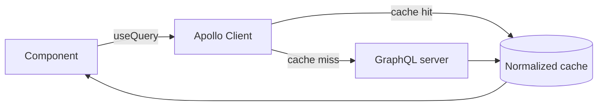

# The cache is the point

Here's the trap most people fall into. They learn GraphQL, see that it returns JSON over HTTP, and conclude that a GraphQL client is "fetch, but for GraphQL." So they reach for `fetch`, POST a query string, and get JSON back. That works for one screen. Then the app grows, and the parts that have nothing to do with GraphQL start hurting: the same user is loaded by three components, a profile edit doesn't update the header, and every list keeps a stale copy of rows you already have.

Apollo Client exists to solve that second set of problems. The query syntax is the small part. The big part is a **normalized cache** that sits between your components and the network, and the whole reason to pull in a client library instead of `fetch` is that cache.

## What GraphQL gives the client first

Before the cache, one thing about GraphQL itself shapes everything that follows: the client asks for exactly the fields it wants. With REST, the endpoint decides the shape of the response. With GraphQL, your component does.

```graphql
query GetUser {
  user(id: "42") {
    id
    name
    avatarUrl
  }
}
```

*What just happened:* you asked for three fields and you'll get exactly those three back - no `email`, no `createdAt`, no nested objects you didn't request. Under REST this is the over-fetching problem (the endpoint sends a fat object) and the under-fetching problem (you need a second call for related data). GraphQL collapses both: one request, the precise shape, related data nested in.

If that contrast is new to you, the deep version lives in [GraphQL Explained](/guides/graphql-explained) and [REST APIs Explained](/guides/rest-apis-explained). Here we take it as given and ask the next question: where does that response go once it arrives?

## The normalized cache, plainly

A naive client would store responses by query. "The result of `GetUser` is *this blob*." That's what a `fetch`-based setup does, and it's why the same user ends up duplicated - every query that mentions user 42 keeps its own copy, and they drift apart.

Apollo does something different. It **flattens** every response into a flat table of objects, keyed by type and id. User 42 is stored once, under a key like `User:42`, no matter how many queries returned it.

```text
ROOT_QUERY
  user({"id":"42"})  ──►  ref: User:42

User:42
  id:        "42"
  name:      "Ada"
  avatarUrl: "https://.../ada.png"
```

*What just happened:* the cache split the response into two pieces. `ROOT_QUERY` remembers that the `user(id: 42)` query points at the object `User:42`, and `User:42` holds the actual fields. The query result is a *reference*, not a copy. That single indirection is the whole trick.

Why does that matter? Because the next time *any* query returns user 42 - a different screen, a different query name, a list that happens to include them - Apollo writes the fields back into the same `User:42` entry. Every component reading that user is looking at one source of truth.

```text
ROOT_QUERY
  user({"id":"42"})       ──►  ref: User:42
  teamMembers             ──►  [ ref: User:42, ref: User:51, ... ]

User:42   (one entry, two readers)
  name: "Ada"   ◄── update this once, both views re-render
```

*What just happened:* a list query and a single-user query both resolved to the same `User:42` object. Update that name once and Apollo re-renders every component subscribed to it. No event bus, no manual prop-drilling, no "refresh the header after save." This is the payoff you cannot get from `fetch` without rebuilding a chunk of Apollo by hand.

> The cache keys off `__typename` plus `id` (or `_id`) by default. If your objects don't carry a stable id, normalization silently can't happen and you lose most of this benefit. We come back to that landmine in Phase 3.

## How the pieces fit



*What just happened:* a component asks for data through a hook. Apollo checks the normalized cache first. On a hit, it returns instantly with no network call. On a miss, it goes to the server, writes the result into the cache, and serves it. The component never talks to the network directly - it talks to the cache, and the cache talks to the network.

This is the mental flip from REST. In a REST app you think in *requests*: "call `GET /users/42`, hold the result in component state." In Apollo you think in *data that already lives somewhere*: "I need user 42; give me whatever the cache knows, fetch only if it's missing." The request becomes an implementation detail of the cache.

## What you give up

None of this is free, and pretending otherwise is how people get burned in Phase 3. The normalized cache is a second copy of your server's data living in the browser, and like any cache it can be wrong. After a mutation, after a delete, after another user changes something - the cache can hold data the server no longer agrees with. Most of the real work with Apollo is keeping that cache accurate, which is exactly what Phase 2 is about.

**For builders:** the practical line is this. If your app shows the same entities across many screens and edits them in place, the normalized cache earns its weight fast. If you're building a few read-only pages that never share data, `fetch` plus a query string is genuinely enough, and reaching for Apollo is the kind of complexity you'll resent later.

```quiz
[
  {
    "q": "What is the main reason to use Apollo Client instead of plain fetch for GraphQL?",
    "choices": [
      "It makes GraphQL queries shorter to write",
      "Its normalized cache stores each entity once and keeps all views in sync",
      "It is the only way to send a GraphQL query over HTTP",
      "It converts GraphQL responses into REST endpoints"
    ],
    "answer": 1,
    "explain": "GraphQL works fine over fetch. The value Apollo adds is the normalized cache: one copy per entity, automatic view updates."
  },
  {
    "q": "How does Apollo's normalized cache store a response?",
    "choices": [
      "As one blob keyed by the query name",
      "As flat objects keyed by type and id, with queries holding references to them",
      "As raw HTTP responses on disk",
      "It does not store responses; it refetches every time"
    ],
    "answer": 1,
    "explain": "Responses are flattened into a table keyed by __typename and id; query results become references into that table, so an entity is stored once."
  },
  {
    "q": "By default, what does Apollo use to identify an object for normalization?",
    "choices": [
      "The query name",
      "The HTTP status code",
      "The object's __typename combined with its id (or _id)",
      "The order it appeared in the response"
    ],
    "answer": 2,
    "explain": "Default cache keys are __typename + id/_id. Without a stable id, normalization cannot happen and the cache benefits mostly vanish."
  }
]
```

[← Overview](_guide.md) · [Phase 2: Queries and mutations in real components →](02-queries-and-mutations.md)
