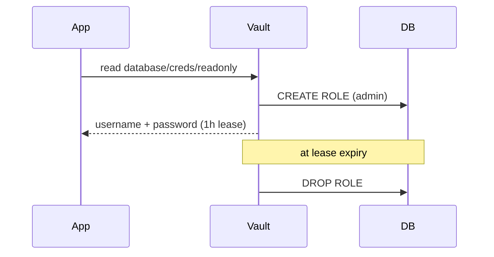

# The Daily Loop

Most days you won't unseal anything or split a root key. You'll log in, read a secret or two, maybe write one, and your apps will fetch credentials at startup. This phase walks the loop you'll actually live in. To follow along without touching real infrastructure, run a dev server - it starts unsealed, in memory, with a known root token, and it prints a warning because it's only for learning.

```console
$ vault server -dev
==> Vault server started! Root Token: hvs.devroot...
WARNING: dev mode is enabled! In-memory, unsealed, NOT for production.
```

*What just happened:* a throwaway Vault is running on `http://127.0.0.1:8200`. Open a second terminal, point the CLI at it, and you're ready.

```console
$ export VAULT_ADDR='http://127.0.0.1:8200'
$ export VAULT_TOKEN='hvs.devroot...'
$ vault status
Sealed     false
Version    1.x.x
```

*What just happened:* the CLI knows where Vault is and who you are. Every command below rides on that token.

## Static secrets: the KV engine

The simplest engine is `kv` - a versioned key-value store for secrets you hold and rotate yourself, like a third-party API key. Write one, read it back:

```console
$ vault kv put secret/myapp/stripe api_key=sk_live_abc123 webhook_secret=whsec_xyz
$ vault kv get secret/myapp/stripe
====== Data ======
Key               Value
api_key           sk_live_abc123
webhook_secret    whsec_xyz
```

*What just happened:* you stored two fields under one path and read them back. In a dev server, `secret/` is a KV v2 mount, so it keeps version history - overwrite `api_key` and the old value is still retrievable by version until you delete it.

To pull only one field, ask for it directly - handy in scripts:

```console
$ vault kv get -field=api_key secret/myapp/stripe
sk_live_abc123
```

*What just happened:* Vault returned the raw value with no formatting, ready to pipe into an env var or config at deploy time instead of baking it into the image.

## Identity first: auth methods and policies

The root token can do anything, which is exactly why apps and people should never use it. Real access starts with an **auth method** that maps an identity to a **policy**. Let's build the smallest real example: a policy that allows reading one path, and an AppRole identity bound to it.

First the policy - written in HCL, granting capabilities on paths:

```hcl
# myapp-policy.hcl
path "secret/data/myapp/*" {
  capabilities = ["read"]
}
```

*What just happened:* this policy says the bearer may `read` anything under `secret/data/myapp/` (the `data/` segment is how KV v2 paths look under the hood) and nothing else. Default-deny means everything not listed is forbidden.

```console
$ vault policy write myapp myapp-policy.hcl
$ vault auth enable approle
$ vault write auth/approle/role/myapp token_policies=myapp token_ttl=1h
```

*What just happened:* you registered the policy, turned on the AppRole auth method, and created a role `myapp` whose logins receive the `myapp` policy and a token that lives one hour. AppRole is built for machines: a service presents a `role_id` (like a username) and a `secret_id` (like a password) and gets a scoped token back.

```console
$ vault read auth/approle/role/myapp/role-id
role_id    7c8f...
$ vault write -f auth/approle/role/myapp/secret-id
secret_id  b41a...
$ vault write auth/approle/login role_id=7c8f... secret_id=b41a...
token             hvs.scoped...
token_policies    ["default" "myapp"]
token_ttl         1h
```

*What just happened:* the app authenticated and got a token scoped to exactly what the `myapp` policy allows. That token can read `secret/myapp/*` and nothing else - a leaked copy can't touch the rest of Vault, and it expires in an hour.

> Pick the auth method that matches the identity you already have. A pod in Kubernetes should use the `kubernetes` method (it proves itself with its service-account token, no extra secret to manage). Humans should use OIDC/SSO. AppRole is the fallback when nothing better fits. The goal is always: stop inventing new credentials to protect other credentials.

## The magic trick: dynamic secrets

Here's where Vault stops being a fancier password file. The `database` secrets engine doesn't *store* a database password - it *creates a fresh one on demand* and deletes it later. Set it up once by telling Vault how to connect as an admin and what kind of user to mint:

```console
$ vault secrets enable database
$ vault write database/config/appdb \
    plugin_name=postgresql-database-plugin \
    connection_url="postgresql://{{username}}:{{password}}@db:5432/app" \
    allowed_roles="readonly" \
    username="vault_admin" password="..."
$ vault write database/roles/readonly \
    db_name=appdb \
    creation_statements="CREATE ROLE \"{{name}}\" WITH LOGIN PASSWORD '{{password}}' VALID UNTIL '{{expiration}}'; GRANT SELECT ON ALL TABLES IN SCHEMA public TO \"{{name}}\";" \
    default_ttl="1h" max_ttl="24h"
```

*What just happened:* you taught Vault to log into Postgres as an admin and defined a `readonly` role whose users get SELECT and self-destruct. Nothing's been issued yet - this is the recipe, not a meal.

Now any app with permission asks for credentials, and Vault generates a brand-new database user each time:

```console
$ vault read database/creds/readonly
username    v-approle-readonly-x7k2p
password    A1a-9zQ...random...
lease_id    database/creds/readonly/abc123
lease_duration   1h
```

*What just happened:* Vault created a real Postgres user that didn't exist a second ago, valid for one hour. When the lease ends, Vault logs back in as admin and drops the user. There's no shared password to leak, no rotation cron to maintain, and a stolen credential is worthless within the hour.



*What just happened:* the secret's whole lifecycle - birth, hand-off, death - is owned by Vault. The app never holds a long-lived credential, and the database never has a stale account lying around.

## Encryption as a service: transit

One more engine worth knowing, because it solves a different problem. Sometimes you don't want Vault to *hold* a secret - you want it to encrypt *your* data without your app ever touching a key. That's the `transit` engine:

```console
$ vault secrets enable transit
$ vault write -f transit/keys/orders
$ vault write transit/encrypt/orders plaintext=$(echo -n "card-4242" | base64)
ciphertext    vault:v1:abcDEF123...
```

*What just happened:* Vault encrypted your data and handed back ciphertext tagged with a key version. Your app stores that ciphertext in its own database. The encryption key never leaves Vault, so a dump of your database is useless without a `transit/decrypt` call - which is policy-gated and audited like everything else.

For builders: transit is how you get strong encryption and key rotation without becoming a cryptographer or shipping keys in your binary. Rotate the key in Vault and old ciphertext (`vault:v1:`) still decrypts while new writes use `vault:v2:`.

```quiz
[
  {
    "q": "What is fundamentally different about a dynamic database secret versus a KV secret?",
    "choices": ["It is encrypted and the KV one is not", "Vault generates a brand-new credential on demand and revokes it at lease end", "It can only be read once", "It is stored in a faster engine"],
    "answer": 1,
    "explain": "The database engine creates a fresh DB user per request and drops it when the lease expires, so there's no shared long-lived password to leak."
  },
  {
    "q": "Why should an app authenticate with AppRole or Kubernetes instead of the root token?",
    "choices": ["The root token is slower", "Scoped tokens are limited by policy and expire, shrinking the blast radius", "Root tokens don't work over the network", "AppRole secrets never expire"],
    "answer": 1,
    "explain": "The root token can do anything. A scoped token is bound to a policy and a TTL, so a leak is contained and self-limiting."
  },
  {
    "q": "What does the transit secrets engine store?",
    "choices": ["Your encrypted application data", "Nothing of yours - it encrypts/decrypts data you keep, the key stays in Vault", "Database credentials", "Unseal keys"],
    "answer": 1,
    "explain": "Transit is encryption-as-a-service: the key never leaves Vault, and you store the resulting ciphertext yourself."
  }
]
```

[← Phase 1: Sealed by Default](01-sealed-by-default.md) · [Overview](_guide.md) · [Phase 3: Leases, Revocation, and Reality →](03-leases-revocation-and-reality.md)
