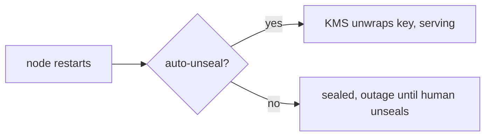

# Leases, Revocation, and Reality

The dev server lied to you a little. It's unsealed forever, it never restarts, and nothing it issues ever expires under load. Production is the opposite, and the gap between the two is where people get paged. This phase is the part you'll wish you'd read before the incident: leases, revocation, the audit log, and the handful of failure modes that define life with Vault.

## Leases: everything has a clock

Almost everything Vault hands out - tokens, dynamic database creds, AWS credentials - comes with a **lease**: an ID and a duration. When the lease expires, Vault revokes the thing automatically. This is the feature, not a nuisance. A credential that dies on its own is a credential a thief can't keep.

The catch is that long-running apps outlive their leases. If your service grabbed a 1-hour database credential at boot and you do nothing, hour two is an outage. The fix is to **renew** before expiry:

```console
$ vault lease renew database/creds/readonly/abc123
lease_id          database/creds/readonly/abc123
lease_duration    1h
```

*What just happened:* the lease clock reset for another hour. Real apps use a Vault client library or the Vault Agent sidecar to renew on a timer, so the credential stays fresh as long as the app runs - and stops being renewed the moment it dies.

> The number that bites: a lease can be renewed only up to its `max_ttl`. A creds role with `default_ttl=1h max_ttl=24h` can renew for at most a day, then the credential is gone no matter how often you ask. Long-lived services must be able to fetch a *new* credential, not renew one forever. Design for the credential disappearing, because eventually it will.

## Revocation: the reason any of this matters

Leasing gives you scheduled cleanup. Revocation gives you the panic button. If a credential leaks, you don't grep your fleet - you tell Vault to kill it, and Vault undoes whatever it created (drops the DB user, deletes the AWS key):

```console
$ vault lease revoke database/creds/readonly/abc123
Success! Revoked lease
```

*What just happened:* that one credential is dead and the underlying database user is gone. During a real incident you can go wider - `vault lease revoke -prefix database/creds/readonly` kills every credential that role ever issued. This is the difference between Vault and a password vault: Vault knows what it issued and can take it all back.

## The audit log: who touched what

Turn on an audit device and Vault writes every request and response to an append-only log. This is non-negotiable for production - it's how you answer "who read the prod secret and when," and it's required for most compliance.

```console
$ vault audit enable file file_path=/var/log/vault/audit.log
```

A log line (trimmed) looks like this:

```json
{"time":"2026-06-30T09:12:04Z","type":"response",
 "auth":{"display_name":"approle-myapp","policies":["default","myapp"]},
 "request":{"operation":"read","path":"secret/data/myapp/stripe"},
 "response":{"data":{"api_key":"hmac-sha256:9f3c..."}}}
```

*What just happened:* Vault recorded who (the AppRole identity), what (read), where (the path), and when - but the secret value is HMAC'd, not printed. You can prove a specific value was accessed without the log itself becoming a place secrets leak. One sharp edge: if *all* configured audit devices fail to write, Vault blocks the request rather than serving it unlogged. Auditing is treated as more important than availability, so monitor your audit sink.

## Auto-unseal, and the seal you'll actually run

Phase 1 used Shamir unseal keys typed by hand. In production that means a credential outage every time Vault restarts, at 3am, requiring three humans. So real deployments use **auto-unseal**: Vault stores its root key wrapped by an external KMS (AWS KMS, GCP KMS, Azure Key Vault, or an HSM) and unwraps it automatically on startup.

```hcl
seal "awskms" {
  region     = "us-east-1"
  kms_key_id = "alias/vault-unseal"
}
```

*What just happened:* Vault now unseals itself by calling the cloud KMS on boot. You've moved the "who can unlock Vault" question to your cloud's IAM, which is auditable and doesn't require waking people up. The Shamir model still matters - it's how recovery keys work even under auto-unseal - but you don't run it by hand.

## The failure modes that define daily life

A few realities that no tutorial mentions until they hurt:

- **Vault is now a hard dependency.** If Vault is down or sealed, apps can't fetch secrets. Run it highly available (a cluster with integrated storage / Raft), and cache or template secrets to disk via Vault Agent so a brief outage doesn't instantly cascade.
- **Sealed-on-restart is normal.** A node that reboots comes back *sealed*. Without auto-unseal, it stays useless until someone unseals it. This surprises people every single time.
- **Tokens and leases pile up.** Apps that authenticate on every request instead of reusing a token can flood Vault with short-lived leases. Reuse tokens, renew, and set sane TTLs.
- **Policy is default-deny and exact.** A path that's off by one segment (`secret/myapp` vs `secret/data/myapp` under KV v2) returns permission denied, not a helpful error. Most "Vault is broken" tickets are a policy path typo.
- **Recovery is a real plan, not a hope.** Losing the unseal/recovery keys *and* the storage backend means the data is unrecoverable by design - that's the security guarantee working against you. Back up storage and store recovery keys the way you'd store the keys to the building.



*What just happened:* the single most common production surprise in one picture - restart equals sealed unless you've set up auto-unseal.

## Where Vault sits in the bigger picture

Vault is the runtime heart of secrets, but it's one layer of a larger discipline. The leases-and-revocation model only protects you if secrets aren't also leaking through your build pipeline, your dependencies, or a committed `.env`. For how secrets fit into the wider problem of protecting what your software depends on, see [/guides/supply-chain-security](/guides/supply-chain-security), and for the broader landscape of secret storage choices, [/guides/secrets-management](/guides/secrets-management).

In the wild: the teams who get the most from Vault are the ones who lean into dynamic, short-lived secrets and let leases do the cleaning. The teams who fight it are the ones who use it as a slightly fancier KV store with eternal static secrets - they get the operational cost of Vault without the payoff. The whole point was to make secrets boring, brief, and accountable. Aim for that.

```quiz
[
  {
    "q": "A long-running service got a 1h database credential with max_ttl=24h. What must it eventually do?",
    "choices": ["Renew the same lease forever", "Fetch a new credential, because the lease can't be renewed past max_ttl", "Restart Vault", "Switch to the root token"],
    "answer": 1,
    "explain": "Renewal works only up to max_ttl. After 24h the credential is gone, so the app must be able to request a fresh one."
  },
  {
    "q": "What does Vault do if every configured audit device fails to write?",
    "choices": ["Serves the request and logs later", "Blocks the request rather than serving it unaudited", "Disables auditing automatically", "Silently drops the log line"],
    "answer": 1,
    "explain": "Vault treats auditing as more important than availability: if it can't record a request, it refuses to serve it."
  },
  {
    "q": "Why do production Vault deployments use auto-unseal?",
    "choices": ["It's faster at encryption", "A restarted node comes back sealed; auto-unseal avoids a 3am manual unseal outage", "It removes the need for policies", "It makes secrets last forever"],
    "answer": 1,
    "explain": "Any restart leaves a node sealed. Auto-unseal lets a KMS/HSM unwrap the root key on boot so the node returns to service without humans."
  }
]
```

[← Phase 2: The Daily Loop](02-the-daily-loop.md) · [Overview](_guide.md)
