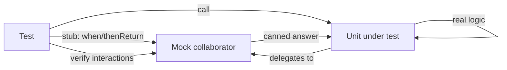

# Mocking with Mockito

JUnit can run a test, but it can't help you with the real problem of unit testing: the class you want to test rarely stands alone. Your `OrderService` calls a `PaymentGateway`, which calls a bank. Your `UserService` reads a `UserRepository`, which hits a database. You do not want your test to charge a real card or need a live database — you want to test *your* logic in isolation, with the collaborators replaced by stand-ins you control.

That's what Mockito is for. A **mock** is a fake object that implements the same interface as a real collaborator, but does nothing on its own. You tell it what to return when called (**stubbing**), and afterward you can ask it what it was called with (**verifying**). The class under test can't tell the difference — and that's the entire point. The conceptual background lives in /guides/mocking-and-test-doubles; here we make it concrete in Java.

## The shape of a Mockito test

Say `OrderService` needs a `PaymentGateway` to place an order. You don't want the real gateway; you want a fake whose answers you dictate.

```java
import static org.mockito.Mockito.*;
import org.junit.jupiter.api.Test;

class OrderServiceTest {

    @Test
    void placesOrderWhenPaymentSucceeds() {
        PaymentGateway gateway = mock(PaymentGateway.class);   // a fake
        when(gateway.charge(100)).thenReturn(true);            // stub it

        OrderService service = new OrderService(gateway);
        boolean placed = service.placeOrder(100);

        assertTrue(placed);
    }
}
```

*What just happened:* `mock(PaymentGateway.class)` built a fake gateway whose every method returns a harmless default (`false`, `0`, `null`) until told otherwise. `when(gateway.charge(100)).thenReturn(true)` is the stub: "if anyone calls `charge(100)`, hand back `true`." Then `OrderService` ran its real logic against that fake and we asserted the outcome. No bank, no network — pure logic.

Read `when(...).thenReturn(...)` out loud as a sentence: *when this method is called like this, then return that.* The call inside `when(...)` doesn't really execute the gateway — Mockito intercepts it to record the rule.

## Wiring mocks in with annotations

Building mocks by hand is fine for one collaborator. With several, the annotation style is cleaner and is what you'll see in most codebases.

```java
import org.junit.jupiter.api.extension.ExtendWith;
import org.mockito.junit.jupiter.MockitoExtension;
import org.mockito.Mock;
import org.mockito.InjectMocks;

@ExtendWith(MockitoExtension.class)
class OrderServiceTest {

    @Mock PaymentGateway gateway;        // a fresh mock per test
    @InjectMocks OrderService service;   // mocks pushed into its constructor

    @Test
    void placesOrderWhenPaymentSucceeds() {
        when(gateway.charge(100)).thenReturn(true);
        assertTrue(service.placeOrder(100));
    }
}
```

*What just happened:* `@ExtendWith(MockitoExtension.class)` hooks Mockito into JUnit's lifecycle. Before each test, `@Mock` creates a fresh `gateway`, and `@InjectMocks` constructs the real `OrderService` and passes the mocks into it. You skipped all the `mock(...)` and `new OrderService(...)` boilerplate, and — importantly — each test gets *fresh* mocks, so stubs from one test don't leak into the next. That extension also fails the build on stubs you set up but never use, which catches stale tests.

## Verifying interactions

Sometimes the thing you care about isn't a return value — it's whether a side effect happened. Did the order actually get saved? Was the email actually sent? `verify` answers that.

```java
@Test
void savesOrderAfterSuccessfulPayment() {
    when(gateway.charge(100)).thenReturn(true);

    service.placeOrder(100);

    verify(repository).save(any(Order.class));   // it WAS called
    verify(gateway, never()).refund(anyInt());   // refund was NOT called
}
```

*What just happened:* `verify(repository).save(...)` asserts that `service.placeOrder` called `save` exactly once during this test. `verify(gateway, never()).refund(...)` asserts the opposite — that a successful order never triggers a refund. Verification turns "I think it does the right thing" into "it provably called the right collaborator." `times(2)`, `atLeastOnce()`, and `never()` cover the counting cases.

## Argument matchers: when the exact value doesn't matter

In `verify(repository).save(any(Order.class))`, that `any(...)` is an **argument matcher**. You used it because the test doesn't care about the exact `Order` instance — only that *something* was saved. Matchers let you stub and verify by pattern instead of by exact value.

```java
when(repository.findById(anyLong())).thenReturn(Optional.of(user));
when(gateway.charge(eq(100))).thenReturn(true);
verify(emailer).send(eq("user@example.com"), contains("receipt"));
```

*What just happened:* `anyLong()` matches any long id; `eq(100)` matches exactly 100; `contains("receipt")` matches any string containing that word. There's one rule that bites everyone: **if you use a matcher for one argument, you must use matchers for all arguments in that call.** `gateway.charge(eq(100), userId)` throws at runtime — mixing a matcher with a raw value is the single most common Mockito error. Wrap the raw one as `eq(userId)` and it's fine.



*What just happened:* the diagram shows the loop — the test programs the mock, runs the real unit, the unit leans on the mock for its dependencies, and the test inspects the mock afterward. The unit under test is the only thing running real code.

> **In the wild:** the strongest tests stub the *inputs* (what collaborators return) and verify only the *outputs that matter* (the one or two side effects that define correct behavior). A test that stubs five methods and verifies all five is usually testing Mockito, not your code.

```quiz
[
  {
    "q": "What does when(gateway.charge(100)).thenReturn(true) do?",
    "choices": ["Calls the real charge method and caches its result", "Tells the mock to return true when charge is called with 100", "Verifies charge was already called with 100", "Asserts that charge returns true"],
    "answer": 1,
    "explain": "It's stubbing: it records a rule so the mock returns true for charge(100). The call inside when(...) is intercepted, not really executed."
  },
  {
    "q": "When must you use argument matchers for ALL arguments in a Mockito call?",
    "choices": ["Always, even with one argument", "Never; you can freely mix matchers and raw values", "Whenever you use a matcher for any one of the arguments", "Only inside verify, never inside when"],
    "answer": 2,
    "explain": "If any argument uses a matcher like any() or eq(), every argument in that call must use a matcher. Mixing a matcher with a raw value throws at runtime; wrap raw values in eq()."
  },
  {
    "q": "What is verify(repository).save(...) checking?",
    "choices": ["That save returns a non-null value", "That the unit under test actually called save during the test", "That save was stubbed beforehand", "That the repository is a real object, not a mock"],
    "answer": 1,
    "explain": "verify asserts an interaction happened — that the code under test called save. It checks behavior (a side effect), not a return value."
  }
]
```

[← Phase 1](01-what-junit-5-actually-is.md) | [Overview](_guide.md) | [Phase 3: When tests lie →](03-when-tests-lie.md)
