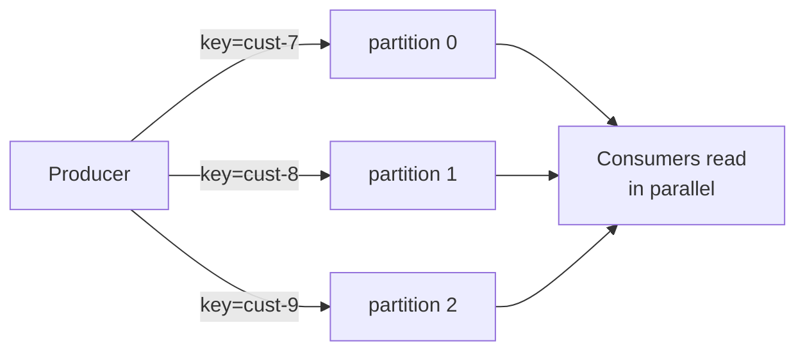

# It's a Log, Not a Queue

Picture the queue you already know: a line of messages, a worker grabs one off the front, processes it, and it's *gone*. One message, one consumer, then it vanishes. That model is burned into most people's heads, and it's exactly the model you have to put down before Kafka makes sense. Kafka doesn't hand out messages and delete them. It keeps a **log** — and the difference changes everything downstream.

## The one analogy: a shared notebook nobody erases

Imagine a notebook where every line is an event, written in order, and **no line is ever crossed out**. Writers only ever append to the bottom. Readers each keep their own bookmark — a sticky note saying "I've read up to line 4,812." Two readers can sit at completely different pages. A reader can move their bookmark *backward* and re-read. Nothing a reader does affects the notebook or any other reader.

That notebook is a Kafka **topic**. The line numbers are **offsets**. The bookmarks are what each consumer commits.

```text
topic "orders"  (an append-only log)
offset:   0      1      2      3      4      5   ← next write goes here
        [evt]  [evt]  [evt]  [evt]  [evt]
                        ▲                  ▲
              consumer-A bookmark   consumer-B bookmark
              (reading offset 2)    (caught up, at 5)
```

*What just happened:* writers only append on the right; each event gets the next offset and stays put. Consumer-A and consumer-B read the *same* events at their *own* pace, and neither one's progress removes anything. Reading is just "advance my bookmark," not "remove from the list."

This is the whole shift. In a queue, consuming is destructive. In Kafka, consuming is **reading a number off a log you don't own.** A message can be read by five different teams, and replayed next month, because it was never anyone's to delete.

## Topics, partitions, offsets — the three nouns

These three words carry most of Kafka. Get them and you're past the hard part.

**Topic** — a named stream of events, like a table name or a channel: `orders`, `payments`, `clicks`. You produce to a topic and consume from a topic. It's the notebook's title.

**Partition** — here's the twist a plain notebook doesn't have. A topic isn't one log; it's split into several parallel logs called **partitions**. Each partition is its own append-only sequence with its own offsets starting at 0.

```text
topic "orders" with 3 partitions

partition 0:  [0][1][2][3][4]
partition 1:  [0][1][2]
partition 2:  [0][1][2][3]
```

*What just happened:* "orders" is really three independent logs. Offset 2 in partition 0 has nothing to do with offset 2 in partition 1 — offsets are *per partition*, never global. This is why "what's the offset of this message" only makes sense once you also name the partition.

**Offset** — the position of an event within one partition. It's a number that only ever goes up as new events are appended. A consumer's whole job, bookkeeping-wise, is "which offset am I at in each partition?"

💡 **Key point.** Ordering in Kafka is guaranteed **within a partition**, never across the whole topic. The events in partition 0 are strictly in order; but partition 0 and partition 1 are independent races. If two events *must* be processed in order relative to each other, they have to land in the same partition — which is exactly what message keys are for (Phase 2).

## Why split a topic into partitions at all?

Two reasons, and they're the reasons Kafka scales when a single queue can't.

**Parallelism.** One log can only be appended to and read in one sequence — that caps your throughput. Split it into 12 partitions and you have 12 logs that can be written and read at the same time, across many machines (called **brokers**). Partitions are the unit of parallelism: more partitions, more consumers can work at once.

**Ordering where it matters, freedom where it doesn't.** You almost never need *global* order across millions of events. You need order *per customer*, or *per account*, or *per device*. Partitions let you say "all events for customer 7 go to the same partition, so they stay in order" while customers 7 and 8 are processed completely in parallel.



*A topic fans out into partitions so many consumers work at once, while a key pins related events to one partition to preserve their order.*

## What "durable" buys you: replay

Because nothing is deleted on read, Kafka can do something a queue fundamentally can't: **replay**. The log sits on disk (replicated across brokers for safety) and stays there for a configured retention window — days, weeks, or forever. That means:

- A brand-new service can start reading from offset 0 and process *all of history* to build up its own view.
- A consumer with a bug can fix the bug, reset its bookmark back, and re-process the events it mangled.
- Two teams can read the same `payments` topic for totally different purposes without coordinating.

> 📝 **Terminology.** A **broker** is one Kafka server. A **cluster** is several brokers working together; partitions are spread across them and **replicated** so a broker dying doesn't lose data. You don't need to manage this by hand to start — but it's why Kafka is called *distributed*: the log lives on many machines, not one.

## For builders

If you've only ever used a queue, the instinct is "I read it, so it's handled, so it's gone." Kill that instinct early. In Kafka, *handled* and *removed* are unrelated. A message stays in the log whether you processed it perfectly or crashed mid-way — and that's a feature, because it means a crash never loses data: you resume from your last committed offset. The flip side, which Phase 3 makes concrete, is that "resume from last offset" can mean re-reading a few events, so your processing needs to tolerate seeing the same event twice.

## Recap

1. Kafka is a **durable, append-only log**, not a queue — reading doesn't delete anything.
2. A **topic** is a named stream; it's split into **partitions**, each an independent log with its own **offsets** starting at 0.
3. Ordering is guaranteed **within a partition**, not across a topic.
4. Partitions exist for **parallelism** (many consumers at once) and **per-key ordering** (related events stay together).
5. Because the log persists, consumers keep their *own* position and can **replay** — one stream feeds many readers.

```quiz
[
  {
    "q": "In Kafka, what happens to a message after a consumer reads it?",
    "choices": [
      "It is deleted from the partition immediately",
      "It stays in the log; the consumer just advances its own offset",
      "It moves to a dead-letter topic",
      "It is locked so no other consumer can read it"
    ],
    "answer": 1,
    "explain": "Kafka is an append-only log. Reading advances a per-consumer offset; the message remains until retention expires, which is what makes replay possible."
  },
  {
    "q": "Within which scope does Kafka guarantee message ordering?",
    "choices": [
      "Across the entire cluster",
      "Across a whole topic",
      "Within a single partition",
      "Across all partitions with the same offset"
    ],
    "answer": 2,
    "explain": "Ordering holds only within one partition. Different partitions are independent, so cross-topic or cross-partition order is not guaranteed."
  },
  {
    "q": "Why is a topic split into multiple partitions?",
    "choices": [
      "To make messages disappear faster after reading",
      "To enable parallelism and keep related (same-key) events ordered together",
      "To encrypt each partition separately",
      "To guarantee a single global order across the topic"
    ],
    "answer": 1,
    "explain": "Partitions are the unit of parallelism — many can be read at once — and keys route related events to the same partition so their order is preserved."
  }
]
```

---

[← Guide overview](_guide.md) · [Phase 2: Producing and Consuming for Real →](02-producing-and-consuming.md)
