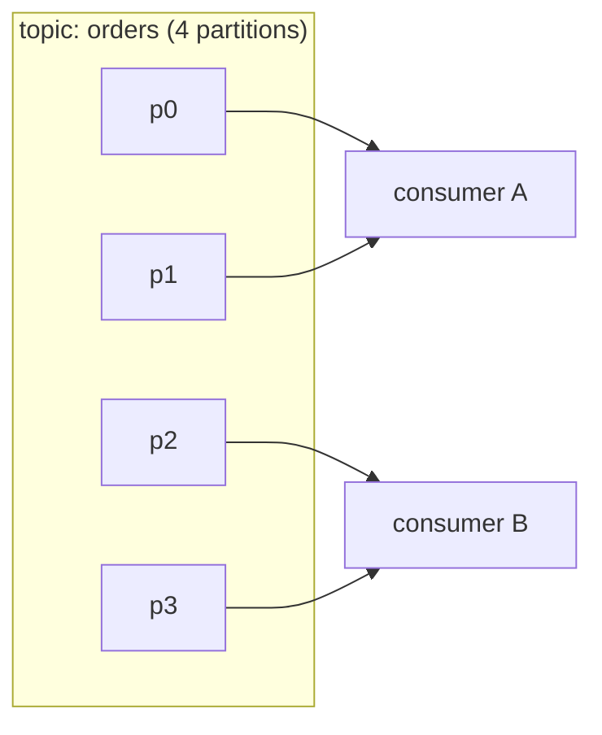

# Producing and Consuming for Real

You've got the model: a partitioned, append-only log with per-consumer bookmarks. Now for the part you'll actually do every day - putting events in and getting them out, at scale, without losing your place. The two questions this phase answers are the two that trip everyone up: **which partition does my message go to?** and **how do I run ten consumers without each one re-processing everything?**

## Producing: a message is a key, a value, and a destination

A Kafka record is mostly three things: a **key** (optional), a **value** (your payload, usually JSON or Avro bytes), and the **topic** it's headed to. You hand it to a producer; the producer figures out the partition and sends it.

Let's send one with the built-in CLI so there's no client library in the way:

```bash
# Produce two messages to the "orders" topic.
# Format here is  key:value , split on the first colon.
kafka-console-producer \
  --bootstrap-server localhost:9092 \
  --topic orders \
  --property "parse.key=true" \
  --property "key.separator=:"
> cust-7:{"order":"A100","amount":42}
> cust-7:{"order":"A101","amount":18}
```

*What just happened:* both records carry the key `cust-7`. Kafka hashes the key to choose a partition, and **the same key always hashes to the same partition** - so both of customer 7's orders land in the same partition, in the order you sent them. That's the mechanism behind "per-key ordering" from Phase 1.

**The partitioning rule, plainly:**

- **Key present** → partition = `hash(key) % number_of_partitions`. Same key, same partition, order preserved.
- **No key** → the producer spreads records across partitions (round-robin-ish) for even load. Fast, but you give up ordering between those records.

💡 **Key point.** The key is not an ID you look records up by - Kafka has no "get message by key." The key exists for *one* job: deciding the partition, and therefore deciding what stays ordered together. Choose it to match your ordering need: `user_id` if per-user order matters, `account_id` for per-account, and so on.

⚠️ **Watch out.** Adding partitions later *changes* `hash(key) % N`, so the same key can start landing in a different partition than before. Existing ordering guarantees for in-flight keys break at that moment. Pick a partition count with growth in mind; changing it is not free.

## Consuming: read the log, track your offset

A consumer subscribes to a topic and pulls records in offset order from each partition it's assigned. Reading them is the easy half. The half that matters is **committing offsets** - telling Kafka "I've successfully handled up to here," so that if you restart you resume from the right spot instead of from 0 or from a random place.

```bash
# Read "orders" from the very beginning, in a named group.
kafka-console-consumer \
  --bootstrap-server localhost:9092 \
  --topic orders \
  --group billing \
  --from-beginning
{"order":"A100","amount":42}
{"order":"A101","amount":18}
```

*What just happened:* the consumer joined the group `billing`, read from offset 0 because that group had no saved position yet, and as it read it committed its progress under the name `billing`. Restart this exact command and it picks up after A101 - not from the beginning - because the *group's* committed offset is remembered by Kafka.

> 📝 **Terminology.** A committed offset is stored per **(group, topic, partition)**. It is "the next offset this group will read." Committing is a deliberate act - commit too early and a crash makes you *skip* unprocessed records; commit too late and a crash makes you *re-read* records. Phase 3 is about living with that trade-off in practice.

## Consumer groups: the scaling move

Here's the feature that makes Kafka a workhorse. A **consumer group** is a set of consumers that share the work of one topic by **dividing the partitions among themselves**. Each partition is handled by exactly one member of the group at a time - so adding members adds throughput, up to the partition count.



*Group "billing" has two consumers; Kafka assigns 2 partitions to each. Add a third consumer and the assignment rebalances to roughly 1–2 partitions each.*

Two rules fall straight out of this picture:

1. **Parallelism is capped by partitions.** A group can usefully have at most as many active consumers as the topic has partitions. A 4-partition topic with 6 consumers leaves 2 consumers idle - there's nothing left to assign them.
2. **Different groups are independent.** The `billing` group and an `analytics` group each get *their own* copy of every record and *their own* committed offsets. That's Phase 1's "one stream, many readers" made concrete: each group reads the full topic without stepping on the other.

```bash
# Inspect a group: see lag (how far behind it is per partition).
kafka-consumer-groups \
  --bootstrap-server localhost:9092 \
  --describe --group billing
# GROUP    TOPIC   PARTITION  CURRENT-OFFSET  LOG-END-OFFSET  LAG  CONSUMER-ID
# billing  orders  0          812             815             3    consumer-A
# billing  orders  1          540             540             0    consumer-A
```

*What just happened:* **lag** = `LOG-END-OFFSET − CURRENT-OFFSET`, i.e. how many records have been written that this group hasn't read yet. Partition 0 is 3 behind; partition 1 is caught up. Lag is *the* number you watch in production - steadily climbing lag means your consumers can't keep up with producers.

## In the wild

A typical setup: one `orders` topic with, say, 12 partitions, produced to with `customer_id` as the key. The `billing` group runs 4 consumers (each handling 3 partitions) to charge cards in per-customer order. Separately, an `analytics` group of 2 consumers reads the *same* topic to update dashboards, committing its own offsets, completely unaware billing exists. When Black Friday traffic spikes, billing scales from 4 to 8 consumers and Kafka rebalances partitions across them automatically - no producer change, no analytics change. That elasticity, with ordering preserved per customer, is the everyday payoff of the partition model.

## Recap

1. A record is a **key + value + topic**; the key's hash picks the partition, so same key → same partition → preserved order.
2. **No key** spreads records across partitions for even load but drops ordering between them.
3. **Committing offsets** is how a group remembers what it processed; commit timing decides whether a crash makes you skip or re-read.
4. A **consumer group** splits a topic's partitions among its members - the way you scale reading.
5. Parallelism is **capped by partition count**; **different groups** each read the whole topic independently. Watch **lag** to know if you're keeping up.

```quiz
[
  {
    "q": "You produce records with key=\"user-42\". What does Kafka do with that key?",
    "choices": [
      "Stores it so you can later fetch the record by key",
      "Hashes it to choose a partition, keeping all user-42 records in order together",
      "Uses it to encrypt the message value",
      "Routes the record to whichever consumer is least busy"
    ],
    "answer": 1,
    "explain": "The key's only job is partition selection via hash(key) % N. Same key lands in the same partition, preserving order for that key. Kafka has no get-by-key."
  },
  {
    "q": "A topic has 4 partitions and a consumer group has 6 consumers. What happens?",
    "choices": [
      "All 6 consumers split each partition into pieces",
      "4 consumers each get one partition; 2 sit idle with nothing assigned",
      "Kafka automatically creates 2 more partitions",
      "The group fails to start because consumers outnumber partitions"
    ],
    "answer": 1,
    "explain": "Each partition goes to exactly one group member, so parallelism caps at the partition count. The extra 2 consumers have no partition to handle and stay idle."
  },
  {
    "q": "What does consumer lag tell you?",
    "choices": [
      "How long messages are retained on disk",
      "How many records have been produced but not yet read by that group",
      "The network latency between brokers",
      "How many consumers are in the group"
    ],
    "answer": 1,
    "explain": "Lag is log-end-offset minus the group's current offset - the backlog of unread records. Steadily rising lag means consumers can't keep up with producers."
  }
]
```

---

[← Phase 1: It's a Log, Not a Queue](01-its-a-log-not-a-queue.md) · [Guide overview](_guide.md) · [Phase 3: Production Reality →](03-production-reality.md)
