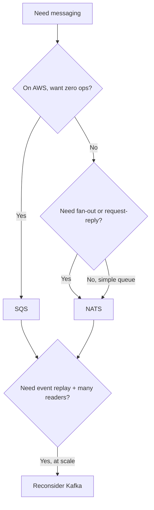

# Phase 1: Not Everything Needs Kafka

Here's the trap. You have two services that need to talk without being wired directly together. You search "message broker," and the internet hands you Kafka: partitions, replication factors, consumer group rebalances, a cluster to babysit. You start to feel that your modest need now requires an operations team.

It doesn't. Most messaging needs are small. A service emits "an order was placed," and one or two other services want to know. Or a request comes in and you want a reply, but over a network instead of a function call. For those, you want the smallest broker that fits. NATS and SQS are two ends of "small": one you run yourself and one AWS runs for you.

## What a broker actually does

Strip away the marketing and a broker does one thing: it sits between a sender and a receiver so they don't have to know about each other. The sender drops a message in. The receiver picks it up later. Neither has to be online at the same moment, neither has to know the other's address, and you can add more receivers without touching the sender.

That decoupling is the whole point. If you've read [the message queues guide](/guides/webhooks-and-message-queues), this is the same mental model - we're now looking at two specific tools and when to pick each.

## NATS: a broker that fits in one binary

NATS is a single small server. You download one file, run it, and you have a broker. No JVM, no ZooKeeper, no cluster required to get started. It speaks a simple text protocol and connects clients in milliseconds.

The core idea in NATS is the **subject** - a dotted string that names what a message is about, like `orders.placed` or `sensors.kitchen.temp`. Publishers send to a subject. Subscribers listen on a subject, and they can use wildcards: `orders.*` matches one token, `sensors.>` matches everything below `sensors`.

```text
publisher  ──▶  subject: orders.placed  ──▶  subscriber A (orders.*)
                                          └─▶  subscriber B (orders.placed)
```

*What just happened:* the publisher named the message by subject and walked away. NATS fanned it out to every subscriber whose pattern matched. The publisher has no idea how many subscribers exist - zero, one, or a thousand - and doesn't care.

By default, core NATS is **fire-and-forget**. If no one is listening when you publish, the message is gone. That sounds scary until you realize how often it's exactly right: live metrics, presence pings, cache-invalidation signals. You don't want yesterday's "user is typing" event. When you *do* need messages to survive, NATS has **JetStream**, a persistence layer that stores messages in a stream and lets consumers replay them. We'll use it in Phase 2.

> NATS also gives you **request-reply** for free: a client publishes a request and waits for one response on a private reply subject. It's RPC over a broker, which means load balancing and failover come along without extra plumbing.

## SQS: a queue you never operate

Amazon SQS is the opposite philosophy. You don't run anything. There's no server, no version to upgrade, no disk to fill. You create a queue through the AWS console or API, and from then on you only send and receive messages. AWS handles durability, scaling, and availability. (For the broader picture of managed services, see [cloud platforms explained](/guides/cloud-platforms-explained).)

SQS is a **queue**, not a pub/sub bus. A message goes in once and is delivered to one consumer, who then deletes it. There's no built-in fan-out to multiple independent readers - if you need that on AWS, you put SNS in front of several SQS queues. Keep SQS in the "work queue" mental slot: a list of tasks that workers pull from.

SQS comes in two flavors, and the difference matters:

```text
Standard queue   →  near-unlimited throughput
                 →  at-least-once delivery  (you may see a message twice)
                 →  best-effort ordering    (not guaranteed)

FIFO queue       →  strict ordering within a message group
                 →  exactly-once processing (dedup within a window)
                 →  lower throughput than Standard
```

*What just happened:* you traded one property for another. Standard gives you huge throughput but can deliver a message more than once and out of order. FIFO guarantees order and de-duplicates, at the cost of throughput. Most workloads want Standard plus idempotent consumers - we'll get to why in Phase 3.

## How to choose

The straightforward decision tree is short:

- **You're already on AWS and want zero ops** → SQS. It's the path of least resistance for background jobs and decoupling services.
- **You want very low latency, request-reply, or true pub/sub fan-out, and you can run a binary** → NATS.
- **You need durable, replayable event streams with many independent consumers and high throughput** → this is where Kafka earns its weight. Don't force NATS or SQS into that shape.



The thing to internalize: brokers are not a ladder where bigger is better. They're tools with different shapes. Picking the smallest one that fits is a sign you understand the problem, not that you cut a corner.

**In the wild:** plenty of production systems run NATS for internal service-to-service chatter and SQS for cloud background jobs *in the same company*. They're not competitors so much as different drawers in the same toolbox.

```quiz
[
  {
    "q": "By default, what happens to a core NATS message published to a subject with no subscribers?",
    "choices": ["It's stored until a subscriber connects", "It's discarded - core NATS is fire-and-forget", "It's sent to a dead-letter subject", "The publish call blocks until someone subscribes"],
    "answer": 1,
    "explain": "Core NATS is fire-and-forget; no subscriber means the message is gone. JetStream is what you add when you need persistence."
  },
  {
    "q": "What's the key delivery difference between an SQS Standard queue and a FIFO queue?",
    "choices": ["Standard is cheaper; FIFO is free", "FIFO has higher throughput than Standard", "Standard is at-least-once and best-effort ordered; FIFO is ordered and de-duplicated", "Standard supports pub/sub; FIFO does not"],
    "answer": 2,
    "explain": "Standard trades exactness for throughput (at-least-once, best-effort order). FIFO guarantees order and dedup at lower throughput."
  },
  {
    "q": "Which need is the best fit for plain SQS rather than NATS?",
    "choices": ["Sub-millisecond request-reply between services", "Fanning one event out to five independent subscribers", "A zero-ops background work queue on AWS", "Replaying a week of events to a new consumer"],
    "answer": 2,
    "explain": "SQS shines as a managed work queue. Fan-out and request-reply are NATS strengths; replay at scale points toward Kafka."
  }
]
```

[← Overview](_guide.md) | [Phase 2: Sending and Receiving for Real →](02-sending-and-receiving-for-real.md)
