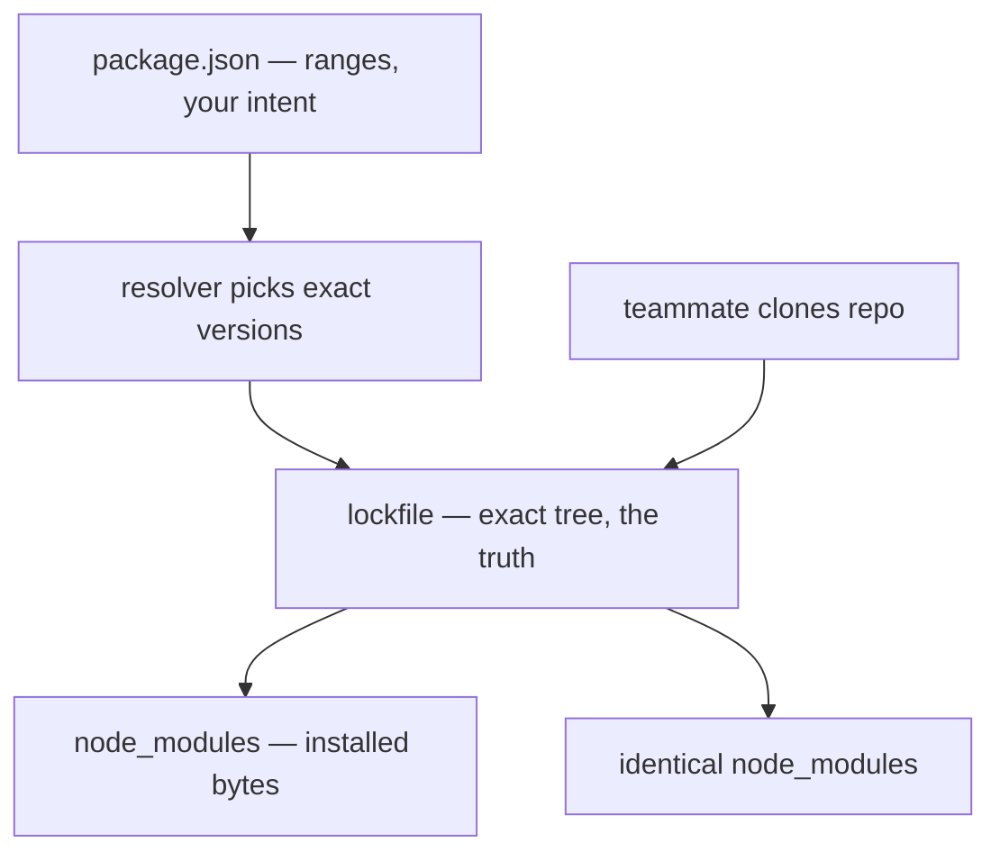

# The Manifest and the Lockfile

Here's the reality you've already lived: you cloned a repo, ran an install, and it worked. Your colleague did the same a week later and got a slightly different result. Neither of you changed `package.json`. That confusion almost always comes from one missing distinction — the difference between what you *asked for* and what you *actually got*. Two files hold those two facts, and they are not the same file.

## Two files, two jobs

Every Node project has a `package.json`. Many also have a lockfile sitting next to it — `package-lock.json` for npm, `pnpm-lock.yaml` for pnpm, `yarn.lock` for Yarn. They look related, and they are, but they answer different questions.

- **`package.json` is your declaration — a wish list.** It says, in human terms, "this project wants Express, somewhere in the version 4 family." It's short, you write it by hand (or via commands), and it describes *intent* using ranges, not exact versions.
- **The lockfile is the receipt — the truth.** It records the *exact* version of every package that got installed, including the packages your packages depend on, all the way down. You don't write it; the package manager generates it. It describes *reality*.

Hold onto this: **`package.json` says what you want; the lockfile says what you have.** When they disagree about what's possible, the lockfile wins on the next install — that's the whole point of it existing.

## What package.json actually contains

Here's a trimmed, realistic one:

```json
{
  "name": "my-app",
  "version": "1.4.0",
  "scripts": {
    "dev": "vite",
    "test": "vitest run"
  },
  "dependencies": {
    "express": "^4.19.2"
  },
  "devDependencies": {
    "vitest": "^1.6.0"
  }
}
```

*What just happened:* this file declares two kinds of dependencies. `dependencies` are needed to *run* the app (Express serves requests). `devDependencies` are needed only to *build and test* it (Vitest never ships to production). The `^4.19.2` next to Express is a **range**, not an exact pin — we unpack what that caret means in [Phase 2](02-installing-and-workspaces.md). The `scripts` block names shortcuts you run with `npm run dev`, `npm test`, and so on.

📝 **Terminology.** A *direct dependency* is one you listed yourself in `package.json`. A *transitive dependency* is one your dependencies pull in. You asked for Express; Express asks for a dozen other packages; those ask for more. `package.json` only lists the handful you chose. Everything else is transitive — and that's where the lockfile earns its keep.

## Why the lockfile has to exist

If `package.json` only stores ranges, then "install the dependencies" isn't a precise instruction. `^4.19.2` means "4.19.2 or any newer 4.x." Run that install today and you get 4.19.2; run it next month after Express ships 4.20.0 and you get 4.20.0 — *with no change to `package.json`*. Multiply that across hundreds of transitive packages and "the same project" quietly becomes a different tree on every machine and every day.

The lockfile freezes that. It writes down the one exact version that was resolved for *every* package in the tree:

```text
package.json says:   express ^4.19.2     (a range — "4.19.2 or newer 4.x")
lockfile says:       express 4.19.2      (exact)
                     body-parser 1.20.2  (exact — transitive, you never asked for this)
                     cookie 0.6.0        (exact — transitive)
                     ...the entire tree, pinned...
```

*What just happened:* the lockfile turned a fuzzy wish ("somewhere in 4.x") into a precise, repeatable fact (these exact versions, this exact tree). With the lockfile committed, anyone who installs gets *byte-for-byte the same dependencies you did* — not "compatible," identical.

This is the difference between "works on my machine" and "works on every machine." The lockfile is the thing that makes a Node install *reproducible*.



*The resolver turns ranges into a pinned tree once; everyone after that installs from the lock, not the ranges.*

## So: do you commit the lockfile?

Yes — almost always. **Commit the lockfile for applications.** It's the only way teammates, CI, and your production build all get the same dependency tree. A lockfile that isn't in version control is a lockfile that isn't doing its job.

⚠️ **Gotcha.** The exception is *libraries* you publish to a registry for others to install. A published library's own lockfile isn't used by the projects that depend on it — they resolve their own tree — so it's conventional not to ship one. But the line that trips people up: even library authors usually *keep* a lockfile in the repo for reproducible local development; they only don't depend on it being honored downstream. If you're building an app, a service, or anything you deploy, the rule is plain: commit it.

⚠️ **Gotcha.** Don't hand-edit the lockfile. It's machine-generated and internally consistent; editing it by hand is how you get a tree that the manager later "corrects" out from under you. To change versions, change `package.json` (or use an install/update command) and let the manager rewrite the lock.

## For builders

When a bug appears only in CI or only in production and "it's fine locally," your first suspect should be the dependency tree, and your first question is: *did everyone install from the same lockfile?* A common cause is CI running a plain install that's allowed to drift from the lock, while you ran an install months ago and never updated. The fix is a strict, lock-respecting install in CI — the exact command for that is in [Phase 3](03-store-and-gotchas.md).

## Recap

1. **`package.json` is the manifest** — your declaration of intent, written with version *ranges*, listing only your *direct* dependencies.
2. **The lockfile is the receipt** — machine-generated, pinning the *exact* version of every package including all *transitive* ones.
3. Ranges make installs non-deterministic over time; the lockfile makes them **reproducible** — identical trees everywhere.
4. **Commit the lockfile for any app or service.** It's the bridge from "works on my machine" to "works on every machine."
5. Never hand-edit it; change `package.json` and let the manager regenerate the lock.

Next, the commands you run every day — and the small print of semver ranges that decides whether an update is a yawn or a 2am page.

```quiz
[
  {
    "q": "What does package.json store that the lockfile does not?",
    "choices": [
      "The exact resolved version of every transitive dependency",
      "Version ranges and your list of direct dependencies",
      "A hash of every installed file",
      "Nothing — they store the same thing"
    ],
    "answer": 1,
    "explain": "package.json holds your intent: ranges for the direct dependencies you chose. The lockfile holds reality: exact pinned versions for the entire tree, transitive packages included."
  },
  {
    "q": "Why can two installs from the same package.json produce different dependency trees?",
    "choices": [
      "package.json is encrypted differently each time",
      "node_modules is randomized for security",
      "Ranges resolve to whatever matching versions are newest at install time",
      "npm installs in a random order"
    ],
    "answer": 2,
    "explain": "A range like ^4.19.2 means '4.19.2 or any newer 4.x'. Run it before and after a new release and you get different versions — unless a committed lockfile pins the exact tree."
  },
  {
    "q": "For an application you deploy, should the lockfile be committed to version control?",
    "choices": [
      "No, it's machine-generated noise",
      "Only on the production branch",
      "Yes — it's what makes installs reproducible across machines and CI",
      "Only if you use pnpm"
    ],
    "answer": 2,
    "explain": "Committing the lockfile is the only way teammates, CI, and production all install the identical tree. Skipping it reintroduces the 'works on my machine' problem the lockfile exists to solve."
  }
]
```

---

[← Guide overview](_guide.md) · [Phase 2: Installing, Updating, and Workspaces →](02-installing-and-workspaces.md)
