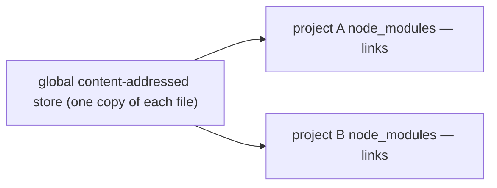

# node_modules, the pnpm Store, and the Gotchas

You've seen the joke about `node_modules` being the heaviest object in the universe. It's funny because everyone has watched the folder swallow gigabytes. This phase explains *why* that happens, what pnpm does differently to fix it, and — more useful than any benchmark — the strictness that catches a class of bug npm and Yarn quietly let through. Then the short list of traps worth knowing before they cost you an afternoon.

## Why node_modules got so big

A dependency tree is deep. Express depends on a dozen packages; each of those depends on more. Worse, two of your dependencies might each want a *different version* of the same small utility. Something has to store all of it.

npm and Yarn (in its classic mode) build a **flat-ish `node_modules`**: they *hoist* as many packages as possible to the top level so they can be shared, and tuck conflicting versions deeper where they're needed. It works, but it has two costs. First, every project gets its **own full copy** of every package on disk — ten projects using React means ten copies of React. Second, hoisting has a side effect we'll come back to: packages you never declared end up sitting at the top of `node_modules`, reachable by your code by accident.

```text
node_modules/              ← npm/yarn: a copy lives here, per project
  express/
  body-parser/             ← hoisted to the top (a transitive dep of express)
  cookie/
  ...hundreds more, all real files, all duplicated across projects
```

*What just happened:* every package is a real, full copy of files inside this project's `node_modules`. Multiply by every project on your machine and the disk usage — and the duplicated download work — adds up fast.

## How pnpm changes the shape

pnpm attacks both costs with one idea: **store every package exactly once on your whole machine, then link it into projects.**

It keeps a single **content-addressed store** (typically under your home directory). "Content-addressed" means each file is stored under a key derived from its contents — so identical files are stored once, period, no matter how many packages or projects use them. When you install, pnpm doesn't copy files into `node_modules`; it creates **hard links** from the global store into the project. The project's `node_modules` becomes a set of links pointing at the one shared copy.



*Ten projects share one physical copy of React; each project's node_modules only links to it.*

Two consequences fall out of this:

- **Disk and speed.** A package you already have anywhere on your machine isn't downloaded or copied again — it's linked. Second and third projects that need React reuse the stored copy, so installs are fast and the disk cost is paid once, not per project.
- **A symlinked layout that is *strict*.** This is the part that matters more than speed.

📝 **Terminology.** *Content-addressed store* — a place where each file is keyed by a hash of its bytes, so duplicates collapse to one. *Hard link* — two directory entries pointing at the exact same data on disk; not a copy. This is the same family of trick Git uses internally to avoid storing identical content twice.

## The strictness: phantom dependencies

Here's the bug npm's flat layout hides. Because hoisting puts transitive packages at the *top* of `node_modules`, your code can `require('cookie')` — a package you never put in `package.json` — and it *works*, purely because Express happened to pull `cookie` up to where your code can see it. That's a **phantom dependency**: you depend on something you never declared.

It's a time bomb. The day Express stops depending on `cookie`, or a new install hoists it somewhere else, your import breaks — and nothing in *your* code or `package.json` changed to explain it.

```console
# Under npm's flat node_modules, this WRONGLY works:
$ node -e "require('cookie')"      # 'cookie' was never in package.json
# (no error — it's hoisted to the top level)

# Under pnpm, the same code fails fast:
$ node -e "require('cookie')"
Error: Cannot find module 'cookie'
```

*What just happened:* pnpm's layout only links packages you *actually declared* into the top level of `node_modules`; everything transitive lives in a nested, non-hoisted structure your code can't reach by accident. So the phantom import that npm silently allowed, pnpm rejects immediately. That early failure is a feature — it surfaces an undeclared dependency now, on your machine, instead of mysteriously in production later.

⚠️ **Gotcha.** This same strictness is why a project that "worked fine on npm" sometimes throws "cannot find module" the moment you switch to pnpm. That is pnpm telling the truth: the code was relying on a phantom dependency all along. The fix is to add the missing package to `package.json` where it belonged — not to fight the tool.

## The one CI command everyone should use

Phase 1 promised reproducible installs; here's how you actually enforce them. A plain `npm install` is allowed to *modify* the lockfile if it thinks the manifest and lock have drifted — convenient locally, dangerous in CI, where you want the build to use exactly what was committed and to *fail loudly* if it can't.

```console
$ npm ci
npm warn ... (nothing to warn about here)
added 412 packages in 4s
```

*What just happened:* `npm ci` ("clean install") deletes `node_modules`, then installs **strictly from the lockfile** — no version re-resolution. If `package.json` and the lockfile disagree, it *errors out* instead of quietly fixing things. That's exactly the behavior you want in automated builds: identical, frozen, and honest. The equivalents are `pnpm install --frozen-lockfile` and `yarn install --immutable`.

⚠️ **Gotcha.** This is the root-cause fix for the "works locally, breaks in CI" dependency mystery from Phase 1. If CI runs a lock-respecting frozen install and *still* differs from your machine, the difference is real and committed — not random — and now you can actually find it. Make every CI pipeline use the frozen variant; it's a one-line change that ends a whole genre of bug.

## Choosing between the three

There's no universal winner, but the trade-offs are short and stable:

```text
manager   strengths                                  watch out for
--------  -----------------------------------------  --------------------------------------
npm       ships with Node, universal, zero setup     flat layout hides phantom deps; per-
                                                     project disk copies
pnpm      fast, disk-cheap (shared store), strict     strictness can expose latent bugs on
          (catches phantom deps), great workspaces    migration; symlinks confuse a few old tools
yarn      mature workspaces, large ecosystem;         classic vs modern (PnP) modes differ a
          fast modern versions                        lot — know which one a repo uses
```

*What just happened:* the honest summary is — npm is the safe default that's always there; pnpm wins on speed, disk, and correctness for anything non-trivial or monorepo-shaped; Yarn is a strong choice especially where a team already standardized on it. **What matters more than the choice: pick one per repo and commit its lockfile.** Mixing managers in one project produces conflicting lockfiles and exactly the non-reproducibility this whole guide is about avoiding.

⚠️ **Gotcha.** Commit *one* lockfile per repo. Seeing `package-lock.json`, `pnpm-lock.yaml`, *and* `yarn.lock` side by side is a red flag — it means different people used different tools, and none of the locks can be trusted. Delete the strays, agree on a manager, regenerate the one true lock.

## In the wild

When a large team migrates to pnpm, the first day is often noisy: a handful of builds fail with "cannot find module" for packages everything seemed to use. That's not pnpm being broken — it's pnpm cashing in years of accumulated phantom dependencies all at once. Teams that understand the mental model fix it in an afternoon by declaring what was always implicitly used. Teams that don't, blame the tool and revert. The difference is exactly the understanding this guide set out to give you.

## Recap

1. **npm/Yarn build a flat, hoisted `node_modules`** with a full per-project copy of every package — which is why the folder gets huge and why **phantom dependencies** sneak in.
2. **pnpm uses one content-addressed store** and links packages into projects, so each file lives on disk once: fast installs, low disk, **strict** layout.
3. pnpm's strictness **catches phantom dependencies early** by refusing to expose anything you didn't declare — a feature, even when it breaks a migrating project.
4. **Use the frozen install in CI** — `npm ci`, `pnpm install --frozen-lockfile`, or `yarn install --immutable` — so builds honor the lockfile exactly and fail loudly on drift.
5. **Pick one manager per repo and commit its single lockfile.** That, more than which tool you chose, is what keeps installs reproducible.

That's the whole model: a manifest of intent, a lockfile of truth, ranges that need a leash, and a store that decides how it all lands on disk. With those four ideas, no package-manager surprise stays surprising for long. For where these installed builds go next, see [Build & Release Basics](/guides/build-and-release-basics).

```quiz
[
  {
    "q": "What is a phantom dependency?",
    "choices": [
      "A package listed in the lockfile but not installed",
      "A package your code uses that you never declared in package.json, reachable only by accident of hoisting",
      "A dev dependency that ships to production",
      "A circular dependency between two packages"
    ],
    "answer": 1,
    "explain": "Flat, hoisted node_modules lifts transitive packages to the top level, so your code can import something it never declared. It works until the tree shifts — then it breaks for no apparent reason."
  },
  {
    "q": "How does pnpm's content-addressed store save disk space and time?",
    "choices": [
      "It compresses node_modules into a single archive",
      "It deletes unused packages nightly",
      "It stores each file once globally and links it into each project instead of copying",
      "It downloads packages on demand at runtime"
    ],
    "answer": 2,
    "explain": "Each file is stored once in a global store keyed by its contents, then hard-linked into projects. Ten projects needing React share one physical copy, so installs are fast and disk is paid once."
  },
  {
    "q": "Why prefer npm ci (or the frozen-lockfile equivalent) over plain install in CI?",
    "choices": [
      "It installs faster by skipping the lockfile",
      "It upgrades dependencies to the latest versions automatically",
      "It installs strictly from the lockfile and errors if the manifest and lock disagree",
      "It works without a package.json"
    ],
    "answer": 2,
    "explain": "ci installs exactly what the lockfile pins and fails loudly on drift instead of quietly rewriting the lock. That gives CI identical, reproducible, honest builds."
  }
]
```

---

[← Phase 2: Installing, Updating, and Workspaces](02-installing-and-workspaces.md) · [Guide overview](_guide.md)
