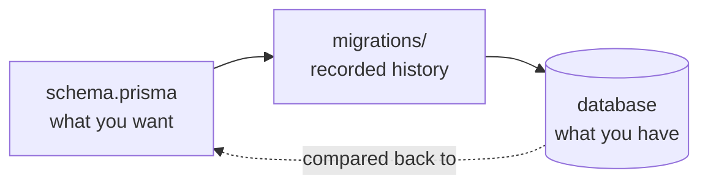

# Schema is the source of truth

Here's the mental shift that makes everything else fall into place: with Prisma, you don't write SQL to change your database by hand. You edit one file that describes the shape you want, and Prisma figures out the SQL to get there. That file is `schema.prisma`, and it is the single source of truth for what your database *should* look like.

Most database tools start the other way around - you write the SQL, the database is the truth, and your code chases it. Prisma flips that. You declare the destination; Prisma writes the directions.

## What the schema looks like

A Prisma schema is a plain text file. Here's a small one:

```prisma
datasource db {
  provider = "postgresql"
  url      = env("DATABASE_URL")
}

generator client {
  provider = "prisma-client-js"
}

model User {
  id        Int      @id @default(autoincrement())
  email     String   @unique
  name      String?
  posts     Post[]
  createdAt DateTime @default(now())
}

model Post {
  id       Int    @id @default(autoincrement())
  title    String
  author   User   @relation(fields: [authorId], references: [id])
  authorId Int
}
```

*What just happened:* you described two tables, their columns, types, a unique constraint on `email`, and a foreign-key relationship - all without writing a line of SQL. The `?` on `name` means nullable. `User` is the truth; the database doesn't exist yet.

## A migration is a frozen snapshot of one change

When you ask Prisma to apply this schema, it doesn't reach into the database live. It writes a **migration**: a folder containing a `migration.sql` file with the exact SQL needed to move the database from its current state to match the schema.

```text
prisma/
  schema.prisma
  migrations/
    20260630120000_init/
      migration.sql
    migration_lock.toml
```

*What just happened:* each migration is a timestamped folder. The folder name is a record of history. The `migration.sql` inside is the literal SQL Prisma will run. Migrations apply in timestamp order, so the folder names define the sequence of your database's life.

Open that `migration.sql` and you'll see ordinary SQL:

```sql
-- CreateTable
CREATE TABLE "User" (
    "id" SERIAL NOT NULL,
    "email" TEXT NOT NULL,
    "name" TEXT,
    "createdAt" TIMESTAMP(3) NOT NULL DEFAULT CURRENT_TIMESTAMP,
    CONSTRAINT "User_pkey" PRIMARY KEY ("id")
);

-- CreateIndex
CREATE UNIQUE INDEX "User_email_key" ON "User"("email");
```

*What just happened:* Prisma translated your declarative schema into concrete `CREATE TABLE` statements. This SQL is now frozen on disk. It is a fact about history - "on this date, we made these tables." That permanence is the whole point, and it's why phase 3 will tell you never to edit it after it's applied.

## Three states, and the gap between them

The reason migrations exist at all is that there are three different "shapes" in play, and they drift apart constantly:



*What just happened:* the schema is intent, the migrations folder is the recorded path, and the database is reality. Prisma's job is to keep these three agreeing. When they disagree, that's **drift**, and detecting it is one of the things that makes Prisma trustworthy on a team - more on that in phase 3.

> Migrations are *generated*, but they are not disposable. Once a migration has run anywhere real, it's part of your project's history, the same way a Git commit is. You add new ones; you don't rewrite old ones.

## For builders

Because the schema is declarative, code review gets pleasant: a reviewer reads the `schema.prisma` diff to understand *intent* ("oh, we added a unique email constraint") and skims the generated `migration.sql` to confirm the *mechanism* is sane. Two files, two questions, no archaeology. Contrast that with a hand-written-SQL workflow where the intent only lives in the author's head.

```quiz
[
  {
    "q": "In Prisma, what is the single source of truth for the desired database shape?",
    "choices": ["The live database", "The migration.sql files", "schema.prisma", "The generated Prisma Client"],
    "answer": 2,
    "explain": "You edit schema.prisma to declare what you want; Prisma derives the SQL to get there."
  },
  {
    "q": "What does a single migration folder contain that actually changes the database?",
    "choices": ["A copy of schema.prisma", "A migration.sql file with concrete SQL", "A TypeScript script", "A JSON diff"],
    "answer": 1,
    "explain": "Each timestamped migration folder holds a migration.sql with the literal SQL Prisma runs, in timestamp order."
  },
  {
    "q": "Why are applied migration files treated as permanent history?",
    "choices": ["Prisma encrypts them", "They are large binary files", "They record what was already run, like Git commits", "The database deletes them after use"],
    "answer": 2,
    "explain": "An applied migration is a fact about what ran. You add new migrations rather than rewrite old ones."
  }
]
```

[← Overview](_guide.md) | [Phase 2: The everyday loop →](02-the-everyday-loop.md)
