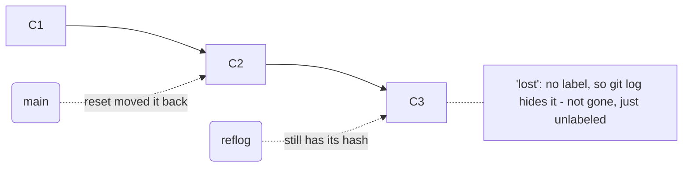

# The Reflog - Your Safety Net

If you only ever learn one recovery tool in Git, make it this one. The **reflog** is the difference between
"I lost a day of work" and "I lost ninety seconds." It's also the thing that proves the promise from the
overview - that your commits are almost never truly gone - so we lead with it, because once you've used it,
every other rescue in this guide feels safe to try.

## The recovery cheat-card

> **Lost something? Find it here, breathe, then read the section. The reflog has your back.**

| "Oh no…" | The calm fix |
|---|---|
| `git reset --hard` threw away commits I wanted | `git reflog`, find the commit, `git reset --hard <hash>` (§3) |
| I made commits on a detached HEAD and they "vanished" | `git reflog`, find them, `git branch <name> <hash>` (§4) |
| I deleted a branch that wasn't merged | Use the hash from the delete message: `git switch -c <name> <hash>` (§5) |
| I have no idea what I just did, but it's bad | `git reflog` first - it shows your last moves so you can step back (§2) |

---

## What the reflog actually is

**What it actually is.** Every time `HEAD` moves - every commit, checkout, switch, reset, merge, rebase -
Git scribbles a line in a private diary called the **reflog** ("reference log"): *where HEAD was, and what
moved it.* It's local to your machine, it's not shared, and it records moves that aren't part of any
branch's visible history.

**Why this is the whole game.** When you "lose" a commit, what really happened is that a label (a branch,
or HEAD) stopped pointing at it, so it fell out of `git log`. But the commit object is still in the
repository - and the reflog still remembers the hash it used to be at. The reflog is the map back to
commits that `git log` can no longer see.



📝 **Terminology.** *Reachable* means "you can get to this commit by following labels and parent pointers."
`git log` shows reachable commits. The reflog can reach commits that nothing else can - which is exactly
why it rescues you.

## 2. Reading the reflog

Run it any time you're disoriented - it's read-only and changes nothing:
```console
$ git reflog
9a1b2c3 (HEAD -> main) HEAD@{0}: reset: moving to HEAD~2
e5f6a7b HEAD@{1}: commit: Add checkout validation
4d3c2b1 HEAD@{2}: commit: Wire up promo codes
9a1b2c3 HEAD@{3}: checkout: moving from feature/x to main
```
*What just happened:* Each line is one move of HEAD, newest at the top. `HEAD@{0}` is where you are now;
`HEAD@{1}` is where you were one move ago, and so on. Read the right-hand text - `reset: moving to...`,
`commit: ...`, `checkout: ...` - and you can literally see your own recent history of actions, each tied to
the commit hash HEAD sat on at the time. Those hashes are your handholds back.

💡 **Key point.** `HEAD@{1}` means "wherever HEAD was 1 move ago." So `git reset --hard HEAD@{1}` often
means "put me back to right before my last action" - the universal undo for "I just did something bad."

## 3. Recover from a `git reset --hard` that went too far

The classic disaster. You meant to undo one commit and fat-fingered three - `--hard`, so the changes are
gone from your files and `git log` no longer shows them:
```console
$ git reset --hard HEAD~3
HEAD is now at 9a1b2c3 Older work
$ git log --oneline -1
9a1b2c3 Older work          # the three newer commits are nowhere in sight
```
Don't touch anything else. Open the reflog and find the commit you were on *before* the reset:
```console
$ git reflog
9a1b2c3 (HEAD -> main) HEAD@{0}: reset: moving to HEAD~3
1a2b3c4 HEAD@{1}: commit: The work I just nuked
...
$ git reset --hard 1a2b3c4
HEAD is now at 1a2b3c4 The work I just nuked
```
*What just happened:* The reflog showed that one move ago (`HEAD@{1}`), `main` pointed at `1a2b3c4` - the
tip of the work you thought you destroyed. `git reset --hard 1a2b3c4` slid `main` back onto it, and your
files came right back with it. The commits were never deleted; the label had just moved off them, and you
moved it back.

⚠️ **Gotcha.** Do the recovery *promptly* and avoid piling on new actions first. Unreachable commits aren't
kept forever - Git's garbage collection eventually prunes them (the default grace period is generous, about
90 days for reachable-from-reflog commits, but don't gamble on it). The reflog itself is also per-machine
and per-clone: it can't rescue something that only ever happened on a teammate's computer.

## 4. Recover commits made on a detached HEAD

Sometimes you check out a specific commit to look around (a "detached HEAD" - HEAD pointing straight at a
commit instead of a branch), make a couple of commits, then switch away. Because no branch label was
following you, those commits become unreachable the moment you leave:
```console
$ git switch main
Warning: you are leaving 2 commits behind, not connected to any of your branches:
  7f8e9d0 Experimental fix
  6e7d8c9 Try another approach
```
Git even warns you and prints the hashes - but if you missed it, the reflog still has them:
```console
$ git reflog
... HEAD@{1}: commit: Experimental fix     (7f8e9d0)
$ git branch rescued-work 7f8e9d0
```
*What just happened:* `git branch rescued-work 7f8e9d0` dropped a brand-new label on that orphaned commit,
making it reachable again - it now shows up in `git log` and is safe. (Creating the label is the fix:
unreachable commits become safe the instant something points at them.)

## 5. Restore a branch you deleted

You deleted a branch that turned out to still have unmerged work on it:
```console
$ git branch -D feature/checkout-redo
Deleted branch feature/checkout-redo (was 3c4d5e6).
```
**Look at that output:** Git printed the tip commit's hash - `(was 3c4d5e6)`. That's all you need to bring
the branch back:
```console
$ git switch -c feature/checkout-redo 3c4d5e6
Switched to a new branch 'feature/checkout-redo'
```
*What just happened:* You recreated the branch label on its old tip commit, restoring the branch exactly as
it was - every commit on it is reachable again. (Scrolled past the delete message? `git reflog` still lists
where that branch's HEAD was; find the tip hash there instead.)

## Why this changes everything

Notice the shape of every fix in this phase: *find the hash in the reflog, then point a label at it.* The
commits were never the problem - they were sitting safe in the repository the whole time. The only thing
you ever lost was a label's aim, and labels are cheap to re-point.

That's why the reflog is the safety net under the rest of this guide. The next two phases use genuinely
sharp tools - `rebase` and rewriting pushed history - and the reason you can wield them calmly is that if
either goes wrong, you already know the way back.

## Your turn: three commits just vanished

Reading the cheat-card is the easy part. Doing it with the afternoon's work missing from `git log` is the
job. There is no single right answer below and nothing is scored right or wrong - but every move costs real
minutes, and the fastest fix is also the calmest one.

```scenario
{
  "title": "reset --hard HEAD~3, when you meant HEAD~1",
  "brief": "It's 4:40pm. You meant to undo your last commit - git reset --hard HEAD~1 - and typed HEAD~3 instead. git log now shows the branch sitting three commits earlier than you left it: the retry logic you've been building since lunch is gone from the tree, and none of it was ever pushed. Nobody else has a copy.",
  "prompt": "What do you do first?",
  "clock": { "unit": "min", "running": "work still missing", "resolved": "back in the tree" },
  "resolvedHeading": "Work's back. Here's how it went.",
  "actions": [
    {
      "id": "reflog",
      "label": "Run git reflog",
      "cost": 1,
      "reveals": "$ git reflog\n9a1b2c3 (HEAD -> main) HEAD@{0}: reset: moving to HEAD~3\n1a2b3c4 HEAD@{1}: commit: Add retry backoff and jitter\n7f6e5d4 HEAD@{2}: commit: Handle idempotency key on retry\n3c2b1a0 HEAD@{3}: commit: Retry queue skeleton\n9a1b2c3 HEAD@{4}: commit: Fix invoice rounding",
      "note": "HEAD@{1} is exactly where you stood one move ago - the tip of the work you just reset past. That hash is the whole rescue."
    },
    {
      "id": "status",
      "label": "Run git log again to confirm exactly what's missing",
      "cost": 1,
      "reveals": "$ git log --oneline -1\n9a1b2c3 Fix invoice rounding\n$ git status\nOn branch main\nnothing to commit, working tree clean",
      "note": "Confirms the branch is three commits short and the tree is clean - which the reset's own output already told you. Cheap, but it doesn't get you any closer to the fix."
    },
    {
      "id": "stash-check",
      "label": "Check git stash list, in case the changes are stashed",
      "cost": 1,
      "reveals": "$ git stash list\n(nothing)",
      "note": "--hard doesn't stash what it discards, it throws the changes away outright. The commits themselves are fine - they just aren't in the stash. A quick, cheap dead end."
    },
    {
      "id": "guess-reset",
      "label": "Reset again, guessing how far back you need to go",
      "cost": 5,
      "reveals": "$ git reset --hard HEAD@{4}\nHEAD is now at 9a1b2c3 Fix invoice rounding\n$ git log --oneline -1\n9a1b2c3 Fix invoice rounding      # further from the work than before",
      "note": "Guessing an index instead of reading the reflog first moved you past your own rescue point. You're now one more reset away from the work, not one closer."
    },
    {
      "id": "reclone",
      "label": "Rename the folder aside and clone a fresh copy to compare",
      "cost": 12,
      "reveals": "$ mv checkout-api checkout-api.bak\n$ git clone git@github.com:acme/checkout-api.git\nCloning into 'checkout-api'...\n$ git log --oneline -1\n9a1b2c3 Fix invoice rounding      # last thing that was ever pushed",
      "note": "The three commits were never pushed, so no clone anywhere has them - only the reflog in your original folder does. This time you renamed it instead of deleting it, so you're still fine. rm -rf first and this would not have been recoverable."
    },
    {
      "id": "retype",
      "label": "Stop trusting Git and retype the retry logic from memory",
      "cost": 40,
      "reveals": "// retry_backoff.js (reconstructed from memory)\nfunction retryWithBackoff(fn, attempts = 3) {\n  // ...missing the idempotency-key check you added after lunch\n}",
      "note": "Forty minutes to reconstruct roughly what you remembered - and you dropped the idempotency-key fix, because you're recreating code, not recovering it. The original three commits, exactly as written, were one git reflog away the whole time."
    },
    {
      "id": "reset-recover",
      "label": "Reset back onto the hash the reflog showed",
      "cost": 1,
      "resolves": true,
      "reveals": "$ git reset --hard 1a2b3c4\nHEAD is now at 1a2b3c4 Add retry backoff and jitter\n$ git log --oneline -3\n1a2b3c4 Add retry backoff and jitter\n7f6e5d4 Handle idempotency key on retry\n3c2b1a0 Retry queue skeleton",
      "note": "All three commits are back, exactly as you left them. The reset never deleted anything - it just moved a label. You moved it back."
    }
  ],
  "debrief": {
    "ideal": 2,
    "text": "The reset didn't delete anything - it moved a label backward, and a label is cheap to move back. git reflog, find the hash from one move ago, git reset --hard onto it: two minutes, and the work is exactly as you left it, bugs included. Every other move either burns time confirming what you already knew, or - like re-cloning - trades a recoverable mistake for one that might not be.",
    "notes": [
      { "when": "if-taken", "action": "guess-reset", "text": "Guessing an index instead of reading the reflog first moved you further from the work, not closer - the exact 'do something' panic instinct this phase exists to interrupt." },
      { "when": "if-taken", "action": "reclone", "text": "You got away with it because you renamed the folder instead of deleting it. The reflog that saves you here lives only in that one local folder - delete it, and even the correct fix stops working." },
      { "when": "if-taken", "action": "retype", "text": "Forty minutes rebuilding from memory got you a rough approximation with at least one dropped fix. The real commits, exactly as written, were sitting in the reflog the whole time." },
      { "when": "if-not-taken", "action": "reflog", "text": "You reset straight onto the hash without ever reading the reflog line. It happened to be the right hash this time - reading it first is what makes that a certainty instead of a guess." }
    ]
  }
}
```

## Recap

1. The **reflog** is Git's local diary of everywhere `HEAD` has been - it can reach commits `git log`
   can't.
2. **`git reflog`** is read-only; run it the instant you're disoriented and read your recent moves.
3. Recover a bad `reset --hard` with **`git reset --hard <hash>`** from the reflog.
4. Rescue detached-HEAD or orphaned commits by **putting a label on them** (`git branch <name> <hash>`).
5. Restore a deleted branch from the **`(was <hash>)`** message (or the reflog): `git switch -c <name> <hash>`.

---

[← Guide overview](_guide.md) · [Phase 2: Rebase Without Fear →](02-rebase-without-fear.md)
