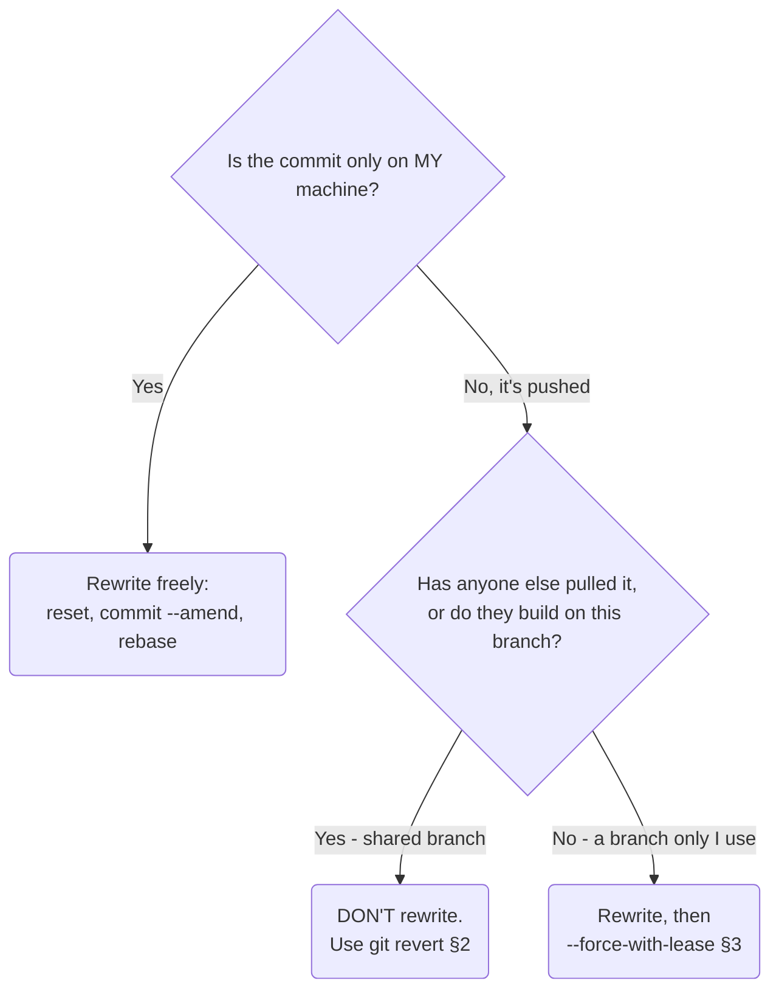

# Undoing What You've Already Pushed

Everything got easier in the earlier guides because of one quiet assumption: the commit lived only on your
machine, so you could rewrite it freely. The moment you `push`, that assumption breaks. Your commits now
exist somewhere else, and other people may have pulled them. Undoing work at that point is less about Git
mechanics and more about *not yanking the rug out from under your teammates*.

The good news: there's a clear rule, and once you know it, this stops being scary.

## The pushed-history cheat-card

> **The first question is always: has anyone else got these commits? Then pick your move.**

| Situation | The calm move |
|---|---|
| Undo a commit on a **shared** branch (`main`, anything others build on) | `git revert <hash>` - a new commit that undoes it (§2) |
| You rewrote **your own** pushed branch (rebase/amend) and need to push | `git push --force-with-lease` (§3) |
| Tempted by plain `git push --force` | Don't, on anything shared - it clobbers teammates' commits (§3) |
| You pushed a secret (key, password) | `revert`/rewrite **won't** erase it from history - rotate the secret now (§4) |

---

## The one distinction that decides everything



Memorize the spirit: **rewriting history is fine until that history is shared; after that, you undo by
*adding*, not by rewriting.** That's the whole phase.

## 2. The safe public undo: `git revert`

**What it actually is.** `git revert` doesn't delete or rewrite anything. It creates a **brand-new commit**
that is the exact *inverse* of a previous one - whatever that commit added, the revert removes, and vice
versa. History stays intact; you've appended "...and now undo that."

**Why it's the safe choice.** Because it only adds a commit, everyone else's history still matches yours.
There's nothing to force, nothing to clobber. This is how you undo something on `main` without causing a
team-wide headache.

```console
$ git revert a1b2c3d
[main 9z8y7x6] Revert "Add promo logic that broke checkout"
 1 file changed, 2 insertions(+), 40 deletions(-)
$ git push
```
*What just happened:* Git made a new commit `9z8y7x6` that undoes everything `a1b2c3d` did, opened an
editor with a pre-filled "Revert ..." message (or use `git revert --no-edit` to skip it), and you pushed
it like any normal commit. The bad change is neutralized and no teammate's repository was disturbed.

⚠️ **Gotcha - reverting a merge commit.** A merge commit has two parents, so Git needs to know which side to
keep. A plain `git revert <merge-hash>` fails asking for a `-m` (mainline) option; the usual form is
`git revert -m 1 <merge-hash>` (keep the first parent - normally `main`). It's a known sharp edge; if you
hit it, that's the fix.

## 3. Rewriting your own pushed branch - with a lease, never a hammer

Sometimes you legitimately need to rewrite history you've already pushed - you rebased your *own* feature
branch (Phase 2) to tidy it before review, and now your local branch and its remote copy disagree. A normal
push gets rejected, because you've rewritten commits the remote still has.

This is the *one* time a force-push is appropriate - but use the safe form:
```console
$ git push --force-with-lease
To github.com:acme/shop.git
 + 8f9e0d1...e1f2a3b feature/cart -> feature/cart (forced update)
```
*What just happened:* `--force-with-lease` overwrote the remote branch with your rewritten history - **but
only after checking that the remote was still where you last saw it.** If a teammate had pushed to that
branch in the meantime, the lease check fails and Git refuses, instead of silently destroying their work:
```console
$ git push --force-with-lease
 ! [rejected]        feature/cart -> feature/cart (stale info)
error: failed to push some refs to 'github.com:acme/shop.git'
```
*What just happened:* The lease caught that the remote had moved (someone else pushed). Git stopped you from
clobbering them. Now you `git fetch`, look at what they did, and reconcile - exactly the protection you
want.

> ⚠️ **Why not plain `git push --force`?** It overwrites the remote *unconditionally* - no check, no mercy.
> If a teammate pushed since your last fetch, `--force` erases their commits permanently. `--force-with-lease`
> does the same job but refuses when it would destroy unseen work. Make it your default; reserve bare
> `--force` for never.

🪖 **War story.** A teammate once ran `git push --force` on `main` to "clean up" his branch, not realizing
two other people had merged that morning. Their commits vanished from the remote - recoverable only because
someone still had them in a local reflog, costing everyone an hour. `--force-with-lease` would have refused
the push; the lease isn't training wheels, it's the seatbelt seniors keep on.

## 4. Communicate - the part Git can't do for you

If you rewrite *any* history other people might share, tell them before and after. The mechanical fix is
easy; the damage comes from a teammate who pulls mid-rewrite and ends up with a tangled branch. A thirty-second
"heads up, I'm force-pushing `feature/cart` in a minute, re-pull after" prevents the whole mess.

And the honest caveat this guide owes you: **none of these tools truly erase data from history.** A
`revert` leaves the original commit in place; even a rewrite leaves the old commits reachable via reflogs
and any clone that already fetched them. So if you pushed a password or key, *do not* assume revert or
force-push hides it - **rotate the secret immediately** (invalidate it and issue a new one). Treat anything
that ever reached a remote as public. (Genuinely scrubbing a secret from all history requires special tools
and coordinating every clone - a deliberate, heavy operation beyond this guide.)

## Recap

1. **The deciding question is "does anyone else have this commit?"** Local-only → rewrite freely; shared →
   undo by adding.
2. **`git revert <hash>`** appends a new commit that inverts an old one - the safe way to undo on `main` or
   any shared branch.
3. To revert a **merge** commit, pick the mainline: `git revert -m 1 <merge-hash>`.
4. Rewriting your **own** pushed branch needs a force-push - always **`--force-with-lease`**, never plain
   `--force`.
5. **Communicate** before rewriting shared history, and **rotate any secret** that ever got pushed - undo
   commands don't erase the past.

---

## That's the whole Git track

Look back at the road you've walked. You started not knowing what a commit was; now you can recover work the
tools themselves had given up on, reshape history deliberately, and undo even pushed mistakes without
hurting anyone. The fear that Git began as - the stomach-drop when something went sideways - is gone,
replaced by a set of calm procedures and the deep knowledge that *your work is almost always still there.*

There's always more Git (submodules, hooks, the plumbing underneath) - but you now have everything the day
job demands, from your first commit to a steady hand in a crisis. That's what the senior who actually cares
would have sat down and shown you. Now someone has.

---

[← Phase 2: Rebase Without Fear](02-rebase-without-fear.md) · [Guide overview](_guide.md)
