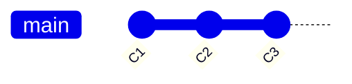
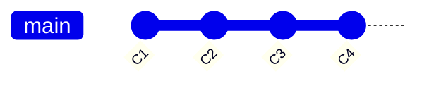
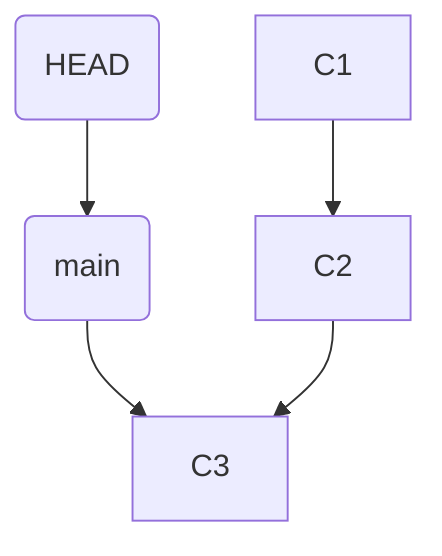
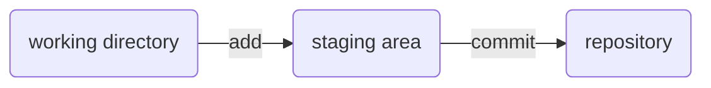
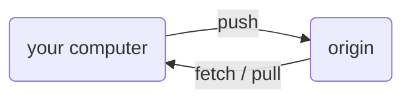

# The Mental Model - What Git Actually Is

You've used Git. You've typed `git commit`, `git push`, maybe `git pull` a hundred times. And yet the
moment something unexpected happens - a merge conflict, a "detached HEAD," a teammate's force-push -
your stomach drops.

Here's the secret nobody tells you: **almost every Git nightmare is the same problem wearing different
masks - not understanding what Git is actually doing underneath.** Git isn't terrifying or arbitrary; it's
built on about five simple ideas. Once they click, the fear doesn't shrink - it disappears, because you can
*reason* about what's happening instead of guessing.

So we won't memorize commands yet. First, the five ideas. Give me twenty minutes and Git stops being a
haunted house.

## Idea 1: A commit is a snapshot

**What it actually is.** A commit is a photograph of your *entire project* at one moment in time - not
"the changes you made," the whole thing, every file, exactly as it looked when you hit commit. Git names
that photograph a unique hash (like `9f2a1c7`) and remembers its *parent*: the commit right before it.

**Why people get this wrong.** Most tutorials say a commit "stores your changes," so people picture Git
stacking diffs. That breaks the first time you try to undo something - a commit is a complete snapshot,
not a diff, and that's what makes everything else make sense.


Each box is a full snapshot pointing back at its parent - walk the arrows backward to see history.

**A real example.**
```console
$ git commit -m "Add login button"
[main 9f2a1c7] Add login button
 1 file changed, 12 insertions(+)
```
*What just happened:* Git snapshotted your project, named it `9f2a1c7`, and recorded its parent - the
commit you were on a moment ago. The `1 file changed` summary is Git being friendly; what it actually
stored is the full snapshot, not only those 12 lines.

**Why this saves you later.** Old versions aren't destroyed when you make new ones - commits only ever
point backward. "I think I lost my work" is almost always wrong: the snapshot is still there, you only
lost sight of it.

## Idea 2: A branch is a sticky note

**What it actually is.** Here's the idea that unlocks everything: **a branch is a sticky note with a
name on it, stuck onto one specific commit.** `main` isn't a copy of your project or a folder - it's a
label that says "this commit is the tip of `main`."


`main` sits on C3, the newest commit - a sticky note, not a copy.

**What it does in real life.** When you commit on `main`, Git creates the snapshot, then *peels the
sticky note off the old commit and sticks it on the new one*. The label always rides the newest commit on
that branch.


Commit C4, and Git peels `main` off C3 onto C4 - the label always rides the newest commit.

**A real example.** Creating a branch costs almost nothing - you're just adding a second sticky note:
```console
$ git branch feature
$ git log --oneline -1
9f2a1c7 (HEAD -> main, feature) Add login button
```
*What just happened:* `git branch feature` put a second label on the *exact same commit* `main` is on -
nothing was copied. The log shows both `main` and `feature` on `9f2a1c7`. That's why branching in Git is
instant: it's a line of bookkeeping, not a duplicate of your code.

**Why this saves you later.** Once you see branches as movable labels, scary things turn simple: "undo a
commit" means move the label back; "committed to the wrong branch" means put a label on it, then move the
wrong label back; "where did my branch go" means the commits are fine, a label moved. Hold onto this
one - it's the most valuable idea in Git.

## Idea 3: HEAD is "you are here"

**What it actually is.** `HEAD` is the "you are here" arrow - it points at the branch you're on, and
therefore at the commit you're sitting on.


Read it as: "you are on `main`, which is currently at commit C3."

**What it does in real life.** Switching branches moves the arrow:
```console
$ git switch feature
Switched to branch 'feature'
```
*What just happened:* HEAD now points at `feature` instead of `main`, and your files on disk changed to
match `feature`'s commit. You didn't move any commits - you moved *yourself*.

**The gotcha: "detached HEAD."** Sometimes HEAD points *directly at a commit* instead of a branch label -
it sounds like a horror-movie injury but means something tame: "you're here, but not on any branch." It
happens when you check out a commit by its hash. Look around safely, but create a branch before committing
anything you want to keep - otherwise no label is following you and those commits get hard to find later.

**Why this saves you later.** "Detached HEAD" is one of the most common Git panics, and it's harmless -
just the "you are here" arrow standing on a commit with no sticky note. The fix: `git switch -c my-branch`.

## Idea 4: The three places your work lives

**What it actually is.** Between "I edited a file" and "it's saved in history," your work passes through
*three* places. This is the source of more confusion than anything else in Git, and it's genuinely
simple once you draw it:



1. **Working directory** - your actual files, with your actual edits. What you see in your editor.
2. **Staging area** (also called the *index*) - a box where you place the changes you want in your
   *next* commit. Picture packing a box before you tape it shut.
3. **Repository** - the committed history; the snapshots that are now permanent.

**What it does in real life.** `git add` copies the current file into the box; `git commit` tapes the box
shut into a snapshot.

```console
$ git add file.js
$ git status
On branch main
Changes to be committed:
  modified:   file.js
```
*What just happened:* `file.js` is now *in the box* ("changes to be committed"). It isn't in history
yet - you haven't committed - but you've decided it's going in the next snapshot.

**The gotcha that bites everyone.** Staging holds the file *as it was the moment you ran `git add`*. Edit
it again afterward and those newer edits aren't in the box - Git will show the same file as both "staged"
and "not staged":
```console
$ git status
Changes to be committed:
  modified:   file.js        (the version you added)
Changes not staged for commit:
  modified:   file.js        (the edits you made AFTER adding)
```
*What just happened:* Both lines are true - the box holds the older version, your working file has newer
edits on top. Run `git add file.js` again to update the box.

**Why this saves you later.** "Why isn't my change in the commit?" and "why is `git diff` empty?" are
both this. Staging is a real place, separate from your files and separate from history - know there are
three places and you always know which one to check.

## Idea 5: The remote is another copy

**What it actually is.** A *remote* (the famous `origin`) is another complete copy of your repository
that lives somewhere else - on GitHub, GitLab, a company server. It isn't special. It isn't "the real
one." It's a peer copy that you sync with.



**What it does in real life.** Three sync operations move commits between the copies:
- **`git push`** - "send my new commits up to origin."
- **`git fetch`** - "download origin's new commits so I can see them," without touching your files.
- **`git pull`** - "fetch, then merge them into what I'm working on" (fetch + apply, in one step).

**The gotcha.** Because both copies move independently, they drift apart. If origin has commits you
don't have yet and you try to push, Git refuses - it won't overwrite history you haven't seen:
```console
$ git push
 ! [rejected]        main -> main (fetch first)
error: failed to push some refs to 'origin'
```
*What just happened:* Someone pushed to origin before you, so the two copies disagree about where `main`
should point and Git won't guess. Pull first (bring in their commits), then push - a sync conflict, not a
catastrophe.

**Why this saves you later.** Much of "Git won't let me push!" terror is just two copies out of sync, and
Git refusing to silently clobber one with the other.

## The five ideas, recapped

That's the whole foundation. Read these five lines slowly:

1. **A commit** is a complete snapshot of your project, with a name and a pointer to its parent.
2. **A branch** is a movable sticky note pointing at one commit.
3. **HEAD** is the "you are here" arrow - usually pointing at your current branch.
4. **Three places**: your files → the staging box (`add`) → committed history (`commit`).
5. **A remote** is another copy you sync with (`push` / `fetch` / `pull`).

Notice what's underneath all five: **Git mostly doesn't destroy things - it moves labels and takes
snapshots.** That's why almost every "oh no" ahead turns out to be recoverable, and why the commands stop
feeling like magic spells.

Next: **[Phase 2 - the everyday commands](02-everyday-commands.md)** maps each command you already type
back to these five ideas.

---

[← Guide overview](_guide.md) · [Phase 2: The Everyday Commands →](02-everyday-commands.md)
