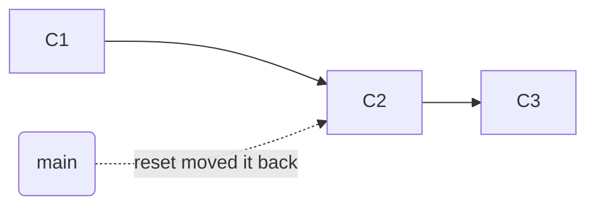

# When It Breaks - Common "Oh No" Moments, Calmly Fixed

This is the phase you came for. Something went wrong, your heart rate is up, and you want it fixed
without making it worse.

Two promises. First: the cheat-card below gives you the fix immediately, no reading required. Second:
under each one, I'll show you *why* the fix works - and you'll notice it's always the same five ideas
from Phase 1. Branches are labels you can move. Commits are snapshots that don't vanish. Once you see
that, "disaster" downgrades to "minor inconvenience."

One rule before we start: **when something looks broken, stop and run `git status`.** It almost always
tells you exactly where you are and what your options are. Panic-typing commands is what turns a small
mess into a big one.

## The emergency cheat-card

> **In a panic? Find your situation, breathe, then read the section below it.**

| "Oh no…" | The calm fix |
|---|---|
| I committed to the wrong branch | Make the right branch here, move the wrong one back (§1) |
| Undo my last commit but keep my work | `git reset --soft HEAD~1` (§2) |
| Merge conflict, markers everywhere | Edit the file, delete the `<<<<`/`====`/`>>>>` markers, `add`, commit (§3) |
| Typo in my last commit message | `git commit --amend` - **only if you haven't pushed** (§4) |
| I staged the wrong file | `git restore --staged <file>` (§5) |

---

## 1. "I committed to the wrong branch"

**The situation.** You're heads-down, you commit - and then you see it. That commit was supposed to land
on `feature-cart`. You were on `main`.

**What's actually happening.** Remember from Phase 1: the commit went onto whatever HEAD pointed at, and
`main` slid forward onto it. Nothing is broken - the commit exists, it's just attached to the wrong
label. You need to (a) get the commit onto the right branch, and (b) move `main` back.

**The calm fix** (for a commit you have *not* pushed yet):
```console
$ git switch -c feature-cart      # make the right branch HERE, taking the commit with you
Switched to a new branch 'feature-cart'

$ git switch main                 # go back to main...
$ git reset --hard HEAD~1         # ...and move main's label back one commit
```
*What just happened:* `git switch -c feature-cart` created that label on the commit you made and moved
you onto it - your work is now safely on `feature-cart`. Then you switched back to `main` and moved its
label back by one (`HEAD~1` = "one commit before HEAD"). You never *moved* the commit - you labeled it
correctly, then slid the wrong label back.

**⚠ The `--hard` warning.** `git reset --hard` throws away any uncommitted changes in your working
directory. Here it's safe *because* your work is already saved on `feature-cart`. But never run `--hard`
when you have unsaved edits you care about - it deletes them with no undo. Unsure? Run `git status`
first to confirm there's nothing uncommitted to lose.

**How to avoid it next time.** Glance at the branch line in `git status` (or your shell prompt) before
committing.

## 2. "Undo my last commit - but keep my work"

**The situation.** You committed too early, or the commit was a mistake - but you do *not* want to lose
the code. You want to rewind the commit and keep the changes.

**What's actually happening.** "Undoing a commit" means moving your branch label back to the parent
commit. The only real question is what happens to the *changes* from the commit you're undoing - the
single difference between the three forms of `reset`:


The label moves from C3 back to C2. The three flavors decide what happens to C3's *contents*:

- **`git reset --soft HEAD~1`** - keep C3's changes **staged**, in the box, ready to re-commit. (As if
  you never hit commit.)
- **`git reset --mixed HEAD~1`** - the default; keep C3's changes in your files but **unstaged**.
- **`git reset --hard HEAD~1`** - throw C3's changes away. Gone.

**The calm fix** (keep the work - the common case):
```console
$ git reset --soft HEAD~1
$ git status
On branch main
Changes to be committed:
  modified:   checkout.js
```
*What just happened:* `main` moved back one commit, and the undone commit's changes are sitting staged,
exactly as they were. Edit, re-stage, and commit again whenever you're ready.

**⚠ The `--hard` warning.** `--hard` is the one that ruins afternoons - it deletes the changes, not only
the commit. Reach for `--soft` or `--mixed` unless you're *certain* you want the work gone. This whole
technique is for commits you **haven't pushed**; rewinding history others already have is a different,
more careful game - guide #2.

> **War story.** Early in my career I found `git reset --hard HEAD~1` on the internet to fix a typo, and
> ran it without knowing `--hard` also meant "delete my uncommitted files." It erased a morning of work
> nobody had warned me about. That's why this guide leads with the *meaning* of every command, not the
> command.

## 3. "I have a merge conflict and I'm terrified"

**The situation.** You merged (or pulled), and Git stopped cold with `CONFLICT (content): Merge conflict
in cart.js`. Strange `<<<<<<<` markers are in your file and you're sure you broke something.

**What's actually happening.** You broke nothing. A conflict means two commits changed the *same lines*,
and Git - true to form - refuses to guess which wins (Phase 1: Git won't silently clobber). It paused the
merge and is asking *you* to decide. That's all a conflict is: an unfinished merge, waiting on a human.

**The calm fix.** Open the conflicted file. You'll see your two options, fenced by markers:
```text
<<<<<<< HEAD
const total = price * quantity          (your version - what's on your branch)
=======
const total = price * qty               (their version - the branch you're merging)
>>>>>>> feature-cart
```
1. Edit the file so it reads exactly how you want the final result to look.
2. **Delete all three marker lines** (`<<<<<<<`, `=======`, `>>>>>>>`).
3. Stage the resolved file and finish the merge:
```console
$ git add cart.js
$ git commit            # completes the merge (Git pre-fills a message for you)
```
*What just happened:* You told Git the final text for the conflicting lines, removed the markers, staged
the result, and committed - finishing the merge it had paused.

**The escape hatch.** Not ready to deal with it? `git merge --abort` puts everything back exactly as it
was before you started - safe to run any time you're mid-conflict and want out.

**How to avoid it next time.** Conflicts come from divergence, so pull/integrate often and keep changes
small. You can't prevent them entirely - and now you don't need to.

## 4. "There's a typo in my last commit message"

**The situation.** You committed "Fix taht bug," and now it's staring back at you.

**What's actually happening.** A commit's message is part of the commit - you can't edit it in place, but
you can *replace* the last commit with an identical one that has a better message.

**The calm fix:**
```console
$ git commit --amend -m "Fix that bug"
[main 7h8i9j0] Fix that bug
 1 file changed, 2 insertions(+)
```
*What just happened:* `--amend` replaced your last commit with a new one - same changes, corrected
message. The hash changed (`7h8i9j0`): it's technically a brand-new commit that took the old one's place.

**⚠ The big warning.** Because `--amend` creates a *new* commit with a *new* hash, it rewrites history -
harmless for a commit that lives only on your machine. But if you already **pushed** that commit,
amending makes your history disagree with the remote's; your next push gets rejected, and force-pushing
stomps on anyone who already pulled. Rule of thumb: **amend freely before you push; think twice after.**
Fixing already-pushed commits safely is guide #2.

## 5. "I staged the wrong file" / "I changed my mind"

**The situation.** You ran `git add` on something you didn't mean to - a debug file, a half-finished
change - and want it *out* of the next commit, without losing your edits.

**What's actually happening.** The file is in the staging box (Phase 1). You want to take it out of the
box while leaving your actual edits untouched in your working directory.

**The calm fix:**
```console
$ git restore --staged debug.log
$ git status
On branch main
Untracked files:
  debug.log
```
*What just happened:* `git restore --staged` removed `debug.log` from the box. Your file and its
contents are untouched - only its "staged" status changed. (On older Git this is written as `git reset
HEAD debug.log`; same effect.)

**⚠ The dangerous look-alike.** `git restore debug.log` - *without* `--staged` - does something very
different: it throws away your working-directory edits and reverts the file to its last committed state.
Memorize the pair:
- `git restore --staged <file>` → unstage, **keep** your edits. (Safe.)
- `git restore <file>` → discard your edits, revert the file. (Destructive - no undo.)

**How to avoid it next time.** Run `git diff --staged` before committing to see exactly what's in the
box. Something surprising there? `restore --staged` it back out.

---

## You're not afraid of Git anymore

Notice what every fix in this phase had in common: none of them were magic incantations. Each one was
you - moving a label, or reading a snapshot - with full knowledge of what Git was doing, because you
learned the model first.

That's the whole point of this guide. Git was never the haunted house it pretended to be. It's a small
set of no-nonsense tools: snapshots that don't vanish, labels you can move, three places your work can live,
and copies you keep in sync.

**Where to go next.** When you're ready for the advanced nightmares - recovering commits you thought were
gone (the reflog), safely undoing history you've *already pushed*, and rescuing a rebase that went
sideways - that's the next guide. You now have the foundation that makes all of it make sense.

---

[← Phase 2: The Everyday Commands](02-everyday-commands.md) · [Guide overview](_guide.md)
