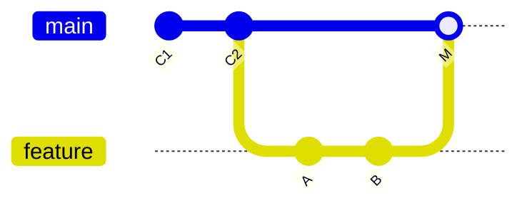
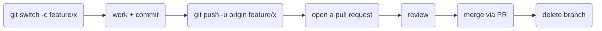

# The Feature-Branch Workflow - Why Nobody Touches main

Your first day on a team repo, someone says "just branch off `main` and open a PR when you're done." If
that sentence had three words you'd have to bluff your way past, you're in the right place. Underneath the
jargon is one simple, sane idea, and once you see it, the whole team workflow falls into place.

Let's start with the rule that surprises solo developers most: **on a team, you don't commit to `main`
directly.** Ever. Here's why - and what you do instead.

## Why `main` is sacred

**What `main` actually is on a team.** It's the one shared branch everyone agrees is *always working* -
the version you could ship right now. Other people pull from it constantly, and often it's what gets
deployed automatically. So if you commit half-finished work straight to `main`, you've just handed everyone
else broken code and maybe pushed a bug to production.

**What you do instead.** You make a **feature branch** - a private line of work that splits off from
`main`. You do all your committing there, in your own sandbox, where half-finished and experimental are
perfectly safe. When the work is done and reviewed, it gets merged back into `main` as one reviewed unit.



💡 **Key point.** A feature branch buys you isolation. Your messy middle is invisible to the team until
you choose to share it, and `main` never sees a broken state. That single habit is the foundation of every
team Git workflow.

## The loop every change travels

Here's the whole life-cycle of one piece of work. We'll spend the rest of this guide on the interesting
parts, but see the shape first:



Let's walk the first half now (the PR and review half is [Phase 3](03-pull-requests-and-review.md)).

## Step 1: Branch off the latest `main`

Before you branch, make sure your `main` is current - you want to build on what the team has, not on
last week's copy:
```console
$ git switch main
$ git pull
Already up to date.
$ git switch -c feature/cart-totals
Switched to a new branch 'feature/cart-totals'
```
*What just happened:* You moved to `main`, pulled the latest from the team, then created `feature/cart-totals`
*from that up-to-date point* and switched onto it (`-c` = create). Your new branch starts life identical to
`main`; from here, your commits land on it alone.

📝 **Terminology.** *Feature branch* is the common name even when the work is a bug fix or a tweak - it just
means "a short-lived branch for one unit of work, off `main`."

## Step 2: Do the work, commit as you go

This is ordinary Git - the loop you already know. Edit, `add`, `commit`, as many times as makes sense:
```console
$ git add pricing.js
$ git commit -m "Calculate cart subtotal before tax"
[feature/cart-totals 9a1b2c3] Calculate cart subtotal before tax
 1 file changed, 14 insertions(+)
```
*What just happened:* A normal commit - but notice it landed on `feature/cart-totals`, not `main`. `main`
hasn't moved; your work is accumulating safely on your own branch. Commit in small, sensible steps; it
makes the review later much easier.

## Step 3: Push your branch so others can see it

Your branch only exists on your laptop until you push it:
```console
$ git push -u origin feature/cart-totals
Enumerating objects: 5, done.
Writing objects: 100% (5/5), 612 bytes | 612.00 KiB/s, done.
remote:
remote: Create a pull request for 'feature/cart-totals' on GitHub by visiting:
remote:      https://github.com/acme/shop/pull/new/feature/cart-totals
remote:
To github.com:acme/shop.git
 * [new branch]      feature/cart-totals -> feature/cart-totals
branch 'feature/cart-totals' set up to track 'origin/feature/cart-totals'.
```
*What just happened:* The first push of a new branch needs `-u origin <branch>` - it creates the branch on
GitHub and links your local branch to it, so future `git push` and `git pull` need no arguments (more on
that link in [Phase 2](02-staying-in-sync.md)). Notice GitHub helpfully printed a URL to open a pull
request - that's your on-ramp to Phase 3.

**Why push before you're finished?** Pushing isn't merging. It backs your work up off your laptop and lets
teammates see progress - but it changes nothing in `main`. Push early and often; it's free safety.

## Naming branches so humans can read them

Branch names are how your team skims who's doing what. Most teams use a short prefix and a hyphenated
description:
```text
   feature/cart-totals       a new capability
   fix/login-redirect-loop   a bug fix
   chore/upgrade-eslint      maintenance, deps, tooling
```
Pick whatever convention your team already uses - consistency matters more than the exact words. The goal
is that a name tells everyone what the branch is *for* at a glance.

## Keep junk out of the shared repo: `.gitignore`

The moment work is shared, files that are fine on your machine become noise for everyone else - your
editor's settings, downloaded dependencies, secret keys, build output. A **`.gitignore`** file tells Git
to pretend certain files don't exist, so they never get committed.

Create a file named `.gitignore` in the repo root listing patterns to ignore:
```text
node_modules/      # downloaded dependencies - huge, and re-installable
dist/              # build output - generated, not source
.env               # secrets and local config - NEVER commit these
*.log              # log files
.DS_Store          # macOS folder clutter
```
*What just happened:* Anything matching these patterns drops out of `git status` entirely - Git stops
offering to track it, so you can't commit it by accident.

⚠️ **Gotcha.** `.gitignore` only ignores files Git isn't *already* tracking. If a file was committed
*before* you ignored it (the classic case: a `.env` full of secrets), adding it to `.gitignore` does
nothing - it stays tracked. You have to stop tracking it with `git rm --cached .env` and commit that. And
if a secret was ever pushed, treat it as compromised and rotate it - *removing it from the latest commit
doesn't erase it from history.* (Scrubbing secrets out of history is advanced-guide territory.)

## The whole picture so far

You now have the first half of the team loop: branch off an up-to-date `main`, commit your work in
isolation, and push the branch so it's backed up and visible - all without `main` ever seeing an unfinished
state. The catch is that `main` doesn't sit still while you work. Keeping up with it is the next phase.

## Recap

1. **Never commit to `main` directly** - it's the always-working, shared, often-deployed branch.
2. **Make a feature branch** off an up-to-date `main` for each unit of work: `git switch -c feature/x`.
3. **Commit freely** on your branch; `main` is untouched until you merge.
4. **Push with `-u origin <branch>`** the first time - it's backup and visibility, not merging.
5. **Name branches** so humans can read them; use **`.gitignore`** to keep junk and secrets out.

Watch it animated: [branching](/explainers/Branching.dc.html)

---

[← Guide overview](_guide.md) · [Phase 2: Staying in Sync →](02-staying-in-sync.md)

## Try it yourself

Run commands and watch the history graph build - `commit -m "first"`, `branch dev`, `checkout dev`, `commit -m "work"`, `checkout main`, `merge dev`:

```playground-git
```
