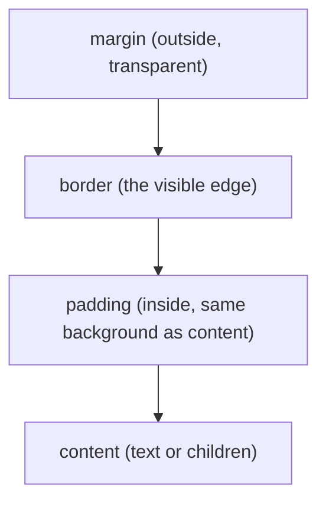

# The Box Model

Every element on your About Me page - the `h1`, the paragraphs, the link - is a rectangle, whether it
looks like one or not. CSS calls that rectangle "the box," and it's made of four layers stacked outward
from the text: content, padding, border, margin. Understanding this box is the difference between
guessing at spacing and controlling it.

```css
.tagline {
  padding: 12px;
  border: 2px solid #1a1a2e;
  margin: 20px 0;
}
```

*What just happened:* the tagline text now sits 12px away from its own border on every side (padding),
wrapped in a visible 2px line (border), with 20px of empty space above and below separating it from
neighboring elements (margin). Three different layers, three different jobs.

## Content, padding, border, margin

**Content** is the text or child elements themselves - what you'd see with every other layer stripped
away.

**Padding** is space *inside* the border, between the content and the box's edge. It's part of the
element - if the element has a background color, padding shows that color.

**Border** is the visible edge of the box. It sits between padding and margin.

**Margin** is space *outside* the border, pushing other elements away. Margins are transparent - you
never see a background color there, only whatever's behind the element.



Think of a framed photo on a wall: the photo is content, the mat around it is padding, the frame is
border, and the gap of wall between it and the next photo is margin.

## The default that surprises everyone: box-sizing

Here's the part that trips up nearly every beginner. By default, `width` only sets the content box -
padding and border get *added on top*, making the element bigger than the width you asked for.

```css
.card {
  width: 300px;
  padding: 20px;
  border: 2px solid black;
}
```

You'd expect a 300px-wide box. You get 344px: 300 (content) + 20 + 20 (padding, both sides) + 2 + 2
(border, both sides). This default is called `content-box`, and it's the box-sizing value every browser
starts with.

⚠️ **The gotcha.** Add padding to fix spacing, and your carefully-measured layout shifts and wraps
because every box quietly grew. This is the single most common "why is my CSS broken" moment for
beginners, and it isn't a bug - it's the spec working as documented, in a way that surprises almost
everyone the first time.

The fix, and one nearly every real stylesheet includes, is switching to `border-box`: `width` then
means the *total* width, padding and border included, and content shrinks to make room.

```css
* {
  box-sizing: border-box;
}
```

*What just happened:* every element on the page now measures padding and border as part of its stated
width instead of adding to it. That `.card` above is now genuinely 300px wide, full stop. This one rule,
applied globally at the top of a stylesheet, is close to a universal default in production CSS - there's
rarely a reason to keep fighting `content-box`.

## display: block vs. inline vs. inline-block

Every element also has a `display` value that decides how it sits next to its neighbors.

**`block`** elements (`div`, `p`, `h1`) take the full width available and stack vertically - each one
starts on a new line. Width, height, padding, and margin all apply exactly as you'd expect.

**`inline`** elements (`span`, `a`, `strong`) flow with the text, sitting side by side like words in a
sentence. `width` and `height` are ignored entirely, and top/bottom margin and padding don't push
neighboring content away - only left/right spacing works.

**`inline-block`** is the middle ground: it flows inline like text, but respects `width`, `height`, and
margin/padding on every side, like a block does.

```css
a {
  display: inline-block;
  padding: 8px 16px;
  background: #1a1a2e;
  color: white;
}
```

*What just happened:* the "Email me" link now has real clickable padding around it and a background
color that actually shows on all sides - none of that works reliably on a plain `inline` element, because
top/bottom padding on `inline` doesn't affect surrounding layout. Switching to `inline-block` keeps the
link sitting next to text while giving it a proper button-like box.

## Recap

1. Every element is a box: content, then padding, then border, then margin, from the inside out.
2. Padding shares the element's background; margin is always transparent space between elements.
3. Default `box-sizing: content-box` adds padding and border on top of `width`. `box-sizing: border-box`
   makes `width` the total size - set it globally with `* { box-sizing: border-box; }`.
4. `display: block` stacks full-width, `inline` flows with text but ignores width/height, `inline-block`
   flows with text while respecting both.

Test what you just learned:

```quiz
[
  {
    "q": "An element has `width: 200px; padding: 10px; box-sizing: content-box;`. What's its total rendered width, ignoring border?",
    "choices": ["200px", "210px", "220px"],
    "answer": 2,
    "explain": "content-box adds padding on top of width on both sides: 200 + 10 + 10 = 220px."
  },
  {
    "q": "What does `box-sizing: border-box` change?",
    "choices": ["Margin becomes part of the width", "Padding and border are included inside the stated width instead of adding to it", "Borders become invisible"],
    "answer": 1,
    "explain": "With border-box, width is the total size - the content area shrinks to make room for padding and border."
  },
  {
    "q": "Why doesn't `height: 40px` do anything on a `span` by default?",
    "choices": ["span elements can't have height in any browser", "span is inline by default, and inline elements ignore width/height", "height only works on the body element"],
    "answer": 1,
    "explain": "Inline elements flow with text and ignore width/height. Switching to inline-block or block makes them apply."
  }
]
```

---

[← Phase 1: Selectors and the Cascade](01-selectors-and-the-cascade.md) · [Guide overview](_guide.md) · [Phase 3: Colors, Units, and Typography →](03-colors-units-and-typography.md)
