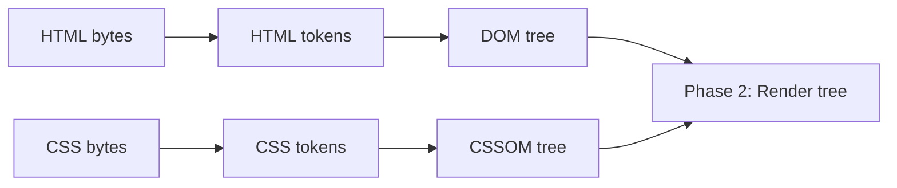

# Parsing: From Bytes to DOM and CSSOM

The browser doesn't wait for the whole HTML file to arrive before it starts working. It reads bytes as
they stream in over the network and builds the page incrementally - which is why a slow server can still
show you a half-rendered page instead of a blank one. Here's what's actually happening in that stream.

## HTML bytes become the DOM

**What it actually is.** The HTML parser reads raw bytes, decodes them into characters, turns those into
tokens (`<div>`, `class="card"`, text), and builds tokens into DOM nodes as it goes. Each node gets
attached to its parent immediately - the tree grows live, not all at once at the end.

**What it does in real life.** This is why `view-source` on a slow-loading page can show content
appearing top to bottom: the browser is parsing and attaching nodes the moment enough bytes have
arrived to form them.

**A real example.**

```html
<!DOCTYPE html>
<html>
  <head><title>Demo</title></head>
  <body>
    <h1>Hello</h1>
    <p>World</p>
  </body>
</html>
```

The parser sees `<html>`, opens the tree. Sees `<head>`, attaches it as a child. Sees `<title>Demo</title>`,
attaches that text node. By the time it reaches `<p>World</p>`, `<h1>Hello</h1>` is already a live node in
the tree - even though the rest of the file hasn't arrived yet.

**The gotcha: `<script>` blocks parsing.** When the parser hits a plain `<script src="...">` (no `defer`,
no `async`), it stops building the DOM entirely. It has to: the script might call
`document.write()` or read/modify the DOM built so far, so the browser can't safely keep going until
that script downloads and runs.

```html
<p>This renders instantly.</p>
<script src="analytics.js"></script>
<p>This waits for analytics.js to download AND execute.</p>
```

If `analytics.js` is slow, that second `<p>` doesn't exist yet - not only visually, but in the DOM itself -
until the script finishes. This is the single most common accidental performance bug in real sites: one
`<script>` tag dropped in the middle of a page, quietly blocking everything after it.

**Why this saves you later.** `defer` tells the browser to keep parsing and run the script after the DOM
is complete, in order. `async` also keeps parsing going but runs the script the moment it's downloaded,
in whatever order downloads finish. For anything that isn't modifying the page during load, reach for
one of the two:

```html
<script src="analytics.js" defer></script>
```

Now parsing continues uninterrupted, and `analytics.js` runs once the DOM is ready.

## CSS bytes become the CSSOM

**What it actually is.** CSS goes through the same journey - bytes, tokens, tree - but the result is
called the CSSOM (CSS Object Model), not the DOM. It happens in parallel with HTML parsing, on its own
timeline.

**Why people get this wrong.** It's tempting to assume CSS "applies" to the DOM directly once parsed. It
doesn't merge with the DOM at parse time - it stays a separate tree of style rules until a later step
(covered in Phase 2) combines the two.

**The gotcha: CSS blocks rendering, not parsing.** The browser keeps parsing HTML into the DOM even while
a stylesheet is loading. But it won't paint anything to the screen until the CSSOM is complete - because
showing unstyled content and then snapping in styles a moment later (a flash of unstyled content) is worse
than a short blank pause. This is why `<link rel="stylesheet">` in `<head>` is standard: get CSS
downloading immediately, before the browser has anything worth painting anyway.

**Why this saves you later.** A giant CSS file, or a slow CSS request, delays first paint even if your
HTML and images are ready. That's the real reason "keep your critical CSS small" is common performance
advice - it's not about parsing speed, it's about how long the browser waits before it's allowed to draw.

## Parsing and CSSOM, side by side



Both trees build independently and both are needed before the browser can move to the next stage - it
can't build a render tree from an incomplete DOM or a half-parsed CSSOM.

## Recap

1. The DOM builds incrementally as HTML bytes stream in - the tree grows live, not all at once.
2. A `<script>` tag without `defer`/`async` halts DOM construction until it downloads and runs.
3. CSS parses into the CSSOM in parallel with HTML parsing, but the browser won't paint until CSSOM is complete.
4. `defer`/`async` exist to let scripts load without stalling the DOM.

Check your understanding of the parsing stage before moving to what the browser builds next.

```quiz
[
  {
    "q": "Why does a plain <script src=\"...\"> tag (no defer/async) stop HTML parsing?",
    "choices": ["The browser can't download two things at once", "The script might modify the DOM, so parsing must pause until it finishes", "Scripts are always larger than HTML files"],
    "answer": 1,
    "explain": "The script could call document.write() or otherwise change the DOM, so the browser halts parsing until the script downloads and runs."
  },
  {
    "q": "What does the CSSOM come from?",
    "choices": ["The DOM tree, after it's built", "CSS bytes, parsed independently of HTML", "JavaScript computing styles at runtime"],
    "answer": 1,
    "explain": "CSS parses into its own tree, the CSSOM, in parallel with HTML parsing into the DOM."
  },
  {
    "q": "What does defer do differently from a plain script tag?",
    "choices": ["Downloads the script faster", "Lets HTML parsing continue, then runs the script after the DOM is complete", "Skips running the script entirely"],
    "answer": 1,
    "explain": "defer keeps parsing going and runs the script in order once the DOM is ready, instead of blocking parsing to run it immediately."
  }
]
```

---

[← Guide overview](_guide.md) · [Phase 2: The Render Tree, Layout, and Paint →](02-the-render-tree-layout-and-paint.md)
