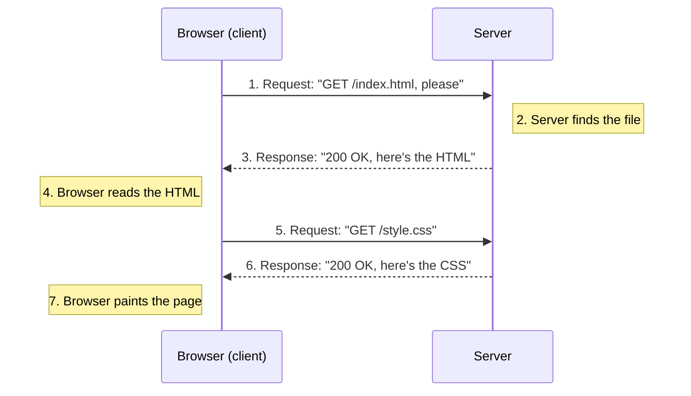

# The Client-Server Model

A browser is a program. A server is also a program. That's the whole secret behind "how the web
works" - two pieces of software, running on two different computers, having a conversation. Once you
stop picturing "the internet" as some ambient cloud and start picturing two specific programs talking,
the rest of this category gets a lot easier to follow.

## What a browser actually is

Chrome, Firefox, Safari, Edge - each is a program whose job is to ask for content and draw it on
screen. When you type `example.com` and hit enter, the browser doesn't "go to a website" the way you'd
walk into a store. It sends a message across the network asking for data, waits, and when data comes
back, it reads that data and paints pixels: text here, an image there, a button in the corner.

The browser is a **client**: the side of the conversation that speaks first. It never receives
anything it didn't ask for. If a page seems to update live - a new comment appears, a stock price
ticks - that's the browser quietly sending more requests in the background, not the server reaching
out on its own.

## What a server actually is

A server is a program that sits and waits for requests, then answers them. It could be running on a
beefy machine in a data center or on a laptop under someone's desk - what makes it "a server" is the
job it does, not the hardware. Popular server programs include nginx, Apache, and countless custom
ones written in Node.js, Python, Go, or Rust.

A server's whole existence is a loop: listen for a request, figure out what's being asked for, send
back a response. It doesn't know or care what the requester looks like - a browser, a phone app, a
command-line tool - it answers what's asked, the same way every time.

📝 **Terminology.** **Client** = the program that asks (your browser). **Server** = the program that
answers (the machine hosting the site). Neither word describes a physical object - both are roles a
program plays in a given conversation. A single machine can even be a server to some connections and
a client to others.

## The request/response cycle

Here's the full loop, start to finish, for loading a simple page:



One page load is rarely one request. The first response usually contains an HTML document, and that
document mentions other things the browser needs - a stylesheet, a script, some images. The browser
reads the HTML, spots those mentions, and fires off more requests automatically. A page that looks
like a single blank-to-loaded flash is often a dozen or more of these request/response pairs happening
in parallel.

💡 **Key point.** Every request follows the same shape: the client says what it wants, the server says
whether it has it and hands it over if so. Multiply that by however many resources a page needs, and
you have a full page load.

## Watching it happen: the Network tab

You don't have to take this on faith - your browser will show you every request it makes. Open
DevTools (right-click any page and choose "Inspect," or press F12) and click the **Network** tab.
Reload the page.

You'll see a list fill in, one row per request: a file name, a status, a type, a size, how long it
took. Click any row and you get the full detail: the exact request the browser sent (its headers, its
method) and the exact response the server sent back (its status code, its headers, its body).

Try this on a real page:

1. Open DevTools, go to Network, and check "Disable cache" so nothing is skipped.
2. Reload the page.
3. Find the first row - it's the HTML document itself, usually named after the page's path.
4. Click it, open the "Response" or "Preview" tab, and look at the raw HTML that came back.
5. Scroll the list. You'll see `.css` files, `.js` files, images, maybe a font - each one a separate
   request/response pair, each one the same pattern from earlier in this phase.

⚠️ **Gotcha.** The Network tab only shows requests made *after* it's open (or after you reload with it
open). If you open DevTools on a page that already finished loading, you'll see an empty list until
you refresh.

This is the single most useful habit for understanding - and later debugging - anything on the web.
When something looks wrong, the Network tab tells you what was actually asked for and what actually
came back, no guessing required.

Check your understanding of client, server, and the request/response loop:

```quiz
[
  {
    "q": "In the client-server model, which side speaks first?",
    "choices": ["The server", "The client", "Whichever one has new data"],
    "answer": 1,
    "explain": "The client (your browser) always sends the request first. The server only ever replies."
  },
  {
    "q": "A page that loads text, a stylesheet, and three images typically involves:",
    "choices": ["Exactly one request", "One request per resource, each its own request/response pair", "No requests once the page is cached"],
    "answer": 1,
    "explain": "The HTML comes back first, and the browser fires additional requests for everything it references."
  },
  {
    "q": "What does the browser's Network tab show?",
    "choices": ["Only failed requests", "The actual requests sent and responses received", "The page's JavaScript source only"],
    "answer": 1,
    "explain": "It's a live log of every request the browser makes and every response it gets back, including headers and status."
  }
]
```

---

[Guide overview](_guide.md) · [Phase 2: URLs, DNS, and HTTP, Together →](02-urls-dns-and-http-together.md)
