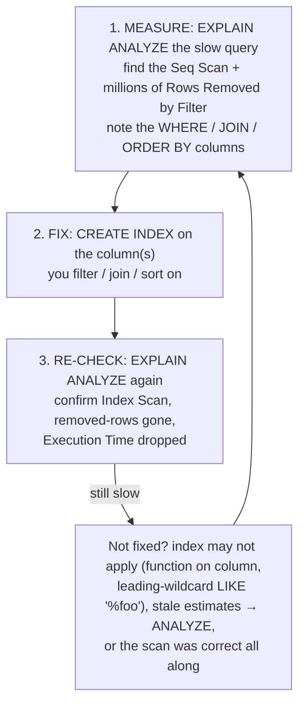

# Reading EXPLAIN

Up to now you've been reasoning about what the database *might* be doing. This phase hands you the flashlight. `EXPLAIN` is how you stop guessing and *see* the database's actual plan for your query — whether it's about to scan ten million rows or jump straight to the three you want. It's the single most useful database-performance skill there is, and it's far less intimidating than its output first looks.

## The two commands

**What they actually are.** There are two tools, and the difference matters:

- **`EXPLAIN`** asks the database, *"What's your plan for this query?"* It does **not** run the query. It returns the plan and the planner's *estimates* (how much work it thinks it'll be, how many rows it expects). Safe and instant — even for a query that would take a minute to run.
- **`EXPLAIN ANALYZE`** *actually runs the query* and reports what really happened — real timings and real row counts, side by side with the estimates. Use this when you want the truth, not a forecast.

⚠️ **Gotcha.** `EXPLAIN ANALYZE` **executes the query**. For a `SELECT` that's harmless. But `EXPLAIN ANALYZE` on an `UPDATE`, `DELETE`, or `INSERT` will *really modify your data*. If you must analyze a write, wrap it in a transaction and roll it back (`BEGIN; EXPLAIN ANALYZE UPDATE ...; ROLLBACK;`), or test against a copy.

## Reading a plan: the scan you're trying to escape

Here's the slow query from Phase 1, before any index, using `EXPLAIN ANALYZE` so we see real numbers (PostgreSQL syntax; MySQL and SQLite have their own `EXPLAIN` output but the same concepts apply):

```sql
EXPLAIN ANALYZE SELECT * FROM users WHERE email = 'ada@example.com';
```

```console
                                            QUERY PLAN
-------------------------------------------------------------------------------------------------
 Seq Scan on users  (cost=0.00..189431.00 rows=1 width=124)
                    (actual time=210.044..844.120 rows=1 loops=1)
   Filter: (email = 'ada@example.com'::text)
   Rows Removed by Filter: 9999999
 Planning Time: 0.071 ms
 Execution Time: 844.182 ms
```

*What just happened:* (the numbers here are illustrative, but this is exactly the shape you'll see) Read it top-down, line by line:

- **`Seq Scan on users`** — the headline. The database read the entire table. This is the thing Phase 1 warned you about, confirmed in writing.
- **`cost=0.00..189431.00 rows=1`** — the *estimate*: a large abstract cost, and an expectation of returning 1 row.
- **`actual time=... rows=1`** — what *really* happened: it returned 1 row, as expected.
- **`Rows Removed by Filter: 9999999`** — the smoking gun. To return that one row, the database looked at ten million rows and *threw away* 9,999,999 of them. Read a lot, return a little — the exact smell from Phase 1.
- **`Execution Time: 844.182 ms`** — the bottom line. Nearly a second to find one row.

That `Rows Removed by Filter` line, sitting in the millions next to a `rows=1` result, is your missing-index alarm going off.

## The same query, after the index

Now add the index from Phase 2 and ask again:

```sql
CREATE INDEX idx_users_email ON users (email);
EXPLAIN ANALYZE SELECT * FROM users WHERE email = 'ada@example.com';
```

```console
                                                  QUERY PLAN
-------------------------------------------------------------------------------------------------------------
 Index Scan using idx_users_email on users  (cost=0.43..8.45 rows=1 width=124)
                                            (actual time=0.041..0.043 rows=1 loops=1)
   Index Cond: (email = 'ada@example.com'::text)
 Planning Time: 0.098 ms
 Execution Time: 0.069 ms
```

*What just happened:* (illustrative numbers, real shape) The headline changed from `Seq Scan` to **`Index Scan using idx_users_email`** — the database is now using your index to jump straight to the row. Three tells confirm the win:

- **`Index Cond`** (not `Filter`) — it used the index *condition* to locate rows, rather than reading everything and filtering. There's no `Rows Removed by Filter` line at all, because it never touched the rows it didn't need.
- **`cost=0.43..8.45`** — the estimated cost dropped from ~189,000 to single digits.
- **`Execution Time: 0.069 ms`** vs. `844 ms` before — same query, same data, same result. The only change was giving the database a shortcut.

📝 **Terminology — the scan types you'll see.** `Seq Scan` = read the whole table (Phase 1's villain). `Index Scan` = use an index to find rows, then fetch them from the table. `Index Only Scan` = the answer was entirely inside the index, so the table wasn't touched at all (the fastest case). In MySQL's `EXPLAIN`, the rough equivalents show up in the `type` column: `ALL` is a full scan (bad for big tables), while `ref`, `range`, and `eq_ref` mean an index is being used.

## Estimated vs. actual: spotting a plan gone wrong

The most powerful habit `EXPLAIN ANALYZE` gives you is comparing the planner's **estimate** to the **actual** result. The planner chooses its plan based on statistics about your data. When those statistics are stale or skewed, the estimate can be badly wrong — and a wrong estimate leads to a wrong plan.

```text
   estimate  rows=1          actual  rows=1            → matched. planner trusts itself, good plan.

   estimate  rows=1          actual  rows=2,400,000    → way off. planner thought "few rows, use the
                                                          index" but there were millions — now it's
                                                          doing millions of slow index lookups. ouch.
```

When estimated and actual row counts are wildly apart, that mismatch — not the scan type alone — is often the real cause of a slow query. The usual fix is to refresh the planner's statistics (`ANALYZE users;` in PostgreSQL, `ANALYZE TABLE users;` in MySQL) so it makes better choices. If a plan stays bad after that, you're at the edge of this guide — planner internals and forcing plans are a deeper *performance* topic.

## The loop: measure, fix, re-check

This is the whole discipline, and it's a loop you can run on any slow query without guessing:



⚠️ **Gotcha — always re-check, never assume.** Creating an index does *not* guarantee the database will use it. If your `WHERE` wraps the column in a function (`WHERE lower(email) = ...` won't use a plain index on `email`), or uses a leading wildcard (`LIKE '%example.com'`), or the planner decides a scan is genuinely cheaper, your shiny new index sits unused. The only way to know it worked is step 3: run `EXPLAIN ANALYZE` again and *see* `Index Scan` with a lower execution time. Measure the fix; don't trust it.

🪖 **War story.** The classic version of this: someone "fixes" a slow query by adding three indexes they *think* are relevant, ships it, and the query is still slow — but now writes are slower too. The fix was always one index, and `EXPLAIN ANALYZE` would have named it in ten seconds: one `Seq Scan`, one `Rows Removed by Filter: 4000000`, one column to index. Measure first. The plan tells you exactly which index to add — you don't have to guess, and you shouldn't.

**Why this saves you later.** The next time a query is slow, you have a procedure instead of a panic. `EXPLAIN ANALYZE` it, look for the scan and the removed-rows count, add the one index the plan points at, and run it again to prove the fix. That loop turns "the database is mysteriously slow" — the worst kind of 2am problem — into a five-minute, evidence-backed fix.

## Recap

1. **`EXPLAIN` shows the plan; `EXPLAIN ANALYZE` runs the query** and shows real timings and row counts. (Careful with `ANALYZE` on writes — it executes them.)
2. **`Seq Scan` + a big `Rows Removed by Filter`** = the database is reading everything to return a little. That's your missing-index alarm.
3. **`Index Scan` with an `Index Cond`** = it's using your index to jump to rows. That's the win you're looking for.
4. **Compare estimated vs. actual rows.** A large mismatch points at stale statistics — run `ANALYZE` — and is often the real culprit behind a bad plan.
5. **Run the loop: measure → add the right index → re-check.** Always confirm with `EXPLAIN ANALYZE` that the index is actually used and the time actually dropped. Don't assume.

That's the everyday skill: see the scan, add the index the plan points at, prove it worked. When this loop *doesn't* solve it — composite-index ordering, lock contention, planner tuning — you've reached the deeper end, and that's where the future *performance* guides will pick up.

---

[← Phase 2: Indexes](02-indexes.md) · [Guide overview](_guide.md)
