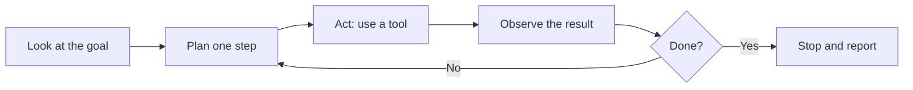

# The Act-Observe Loop

Strip away the branding and every agent runs the same cycle. It is worth burning into your memory, because once you can see the loop, you can predict how an agent will behave and where it will break.

Here it is:



Plan a step. Do it. Look at what came back. Decide if you are done. If not, plan the next step using what you learned. Repeat. That is the engine. A chatbot does one pass and stops. An agent loops.

## Walking through one loop

Say you ask an agent: "Find the cheapest flight from Boston to Lisbon in October and put it on my calendar as a placeholder."

```text
Goal: cheap BOS→LIS flight in October, add to calendar

Step 1 — Plan: I need flight prices. Use the flight-search tool.
Step 1 — Act: search BOS→LIS, October.
Step 1 — Observe: got 12 results, cheapest is Oct 14, $480.

Step 2 — Plan: confirm it's a real bookable fare, not a glitch.
Step 2 — Act: open the Oct 14 listing.
Step 2 — Observe: still $480, one stop, looks legit.

Step 3 — Plan: add a placeholder to the calendar.
Step 3 — Act: create event "Possible LIS trip" on Oct 14.
Step 3 — Observe: event created successfully.

Done? Yes. Report back to the user.
```

Notice what happened. The agent did not plan all three steps up front and march through blindly. It planned *one* step, looked at the result, and the result shaped the next step. If the search had returned nothing, step two would have been "try different dates," not "open the listing." The loop lets the agent react to reality instead of following a fixed script.

## Why the loop is the whole point

This is what makes agents feel smart. Real tasks are full of surprises — a file is missing, a login expired, a number looks wrong. A rigid script snaps the moment reality differs from the plan. The loop bends. Each pass, the agent sees what actually happened and adjusts. That is why an agent can muddle through a messy task that you could not have scripted in advance: it is not following your steps, it is finding its own, one at a time.

It is also why agents can *recover*. Ask it to save a file and the folder does not exist? A good agent observes the error, plans a new step — create the folder — and tries again. You did not tell it to. The loop did.

## Why the loop is also where it goes wrong

The same loop that gives an agent its power gives it three classic failure modes. Watch for all three.

**It misreads the result.** The agent observes the wrong thing — thinks a step worked when it failed, or grabs the wrong number from a page — and then confidently builds the next step on a bad foundation. One misread early can poison everything after it.

**It loops without making progress.** It tries something, it fails, it tries almost the same thing, fails again, and again. Without a stop condition it can churn — sometimes burning real money on tool calls — getting nowhere. This is why serious agents have limits: a maximum number of steps, a budget, a timeout. When you hear an agent "got stuck in a loop," this is it.

**It decides "done" too early or too late.** That `Done?` check is a judgment call the model makes, and it can be wrong. Stop too early and it hands you half a job and calls it finished. Stop too late and it keeps "improving" things you never asked it to touch.

None of these mean agents are useless. They mean the loop is doing exactly what it does — making decisions step by step — and sometimes a step is wrong. The fix is not to trust the loop blindly. It is to watch the steps and put limits around them.

## What this means for you

When you use an agent, you are not getting one answer you can glance at and accept. You are getting a *chain of decisions*, any link of which could be off. So:

- **Read the steps, not only the final answer.** Most agent tools show you what it did. That trace is where you catch the misread before it matters.
- **Give it a clear finish line.** "Draft the email and stop" beats "handle the email." A vague goal makes the `Done?` check a guess.
- **Expect limits, and want them.** Step caps and budgets are not the tool being weak. They are the seatbelt.

The loop is the heart of every agent. Once you see it running, the next question is obvious: how much should you let it do on its own before a human steps in? That is the next phase.
