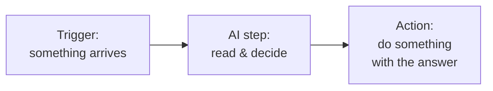

# The Crossover

Think about the two tools you are putting together, and what each is bad at on its own.

A no-code automation tool — Zapier, Make, or n8n — is a tireless errand-runner. It watches for a trigger (a new email, a new row, a filled form) and then carries data from one place to another, following rules you set. It never gets bored, never forgets a step, runs at 3am. But it is rigid. It can only do what you spelled out in advance. Ask it to "figure out whether this email is angry" and it has nothing to offer. It can match exact words and check if a number is over 100. It cannot read.

An AI chat tool is the opposite. Paste a rambling customer email into ChatGPT or Claude and it will tell you the customer is furious about a late refund and wants escalation. It handles the soft, judgment-shaped work that used to need a person. But on its own it is passive. It sits there waiting for you to paste something in and copy something out. It does not watch your inbox. It does not file anything. It forgets the conversation the moment you close the tab.

Put them together and each one covers the other's weakness. The automation tool brings the hands — watching, fetching, filing, sending. The AI brings the eyes and the judgment — reading the mess and deciding what it means. That is the crossover, and it is genuinely more than the sum of the parts.

## What an AI step actually is

Inside a tool like Zapier or Make, an "AI step" is one more block in your chain, sitting between the trigger and the actions. Earlier blocks hand it some text. It sends that text to an AI model along with an instruction you wrote, gets the answer back, and passes that answer down the line to the next block.

The instruction is the whole game. It is the same kind of thing you would type into a chat window, except you write it once and the automation reuses it on every item that comes through. A classification step might be told:

```text
Read the email below. Reply with exactly one word — URGENT, NORMAL, or SPAM —
and nothing else.

Email: {{the email body from the previous step}}
```

That `{{...}}` is a placeholder the automation tool fills in with real data each time it runs. So the same instruction runs against a thousand different emails, and the AI's one-word answer becomes a value the rest of your flow can branch on.

## The shape of the flow

Almost every useful AI-in-the-loop automation has the same three-part skeleton:



- **Trigger** — the event that wakes the flow up. New email, new form submission, new file in a folder, a row added to a sheet.
- **AI step** — the read-and-decide part. It takes the raw input and turns it into something structured: a category, a summary, a draft, a yes/no, a score.
- **Action** — what you do with that decision. Move the email to a folder, post a summary to Slack, save a draft reply, add a row to a tracker, alert a person.

You can chain more than one AI step when the work has stages. A common pattern: one AI step classifies the item, then the flow branches, and a second AI step drafts a reply only for the items that need one. There is no rule that says one AI call per flow — each call costs a little money and time, so you use as many as the job needs and no more.

## Where this earns its keep

The combination shines on work that is high-volume, low-stakes per item, and currently eats a human's attention in small repeated bites. Sorting incoming support mail. Turning long meeting transcripts into action-item lists. Flagging which of fifty inbound sales emails are worth a reply. Pulling the key fields out of invoices that arrive as messy PDFs.

What it is not good for, yet, is anything where a single wrong answer is expensive and unrecoverable. AI steps are confidently wrong sometimes. They will cheerfully classify an angry customer as "NORMAL" or invent a refund amount that was never mentioned. That is not a reason to avoid them — it is the reason Phase 3 exists. The trick is to point this combination at work where being right 95% of the time, with a human catching the rest, is a huge win over doing all of it by hand. Most office work fits that description better than people expect.

In the next phase we stop talking in the abstract and build one: incoming email, read and sorted and drafted by AI, inside an automation tool, step by step.
