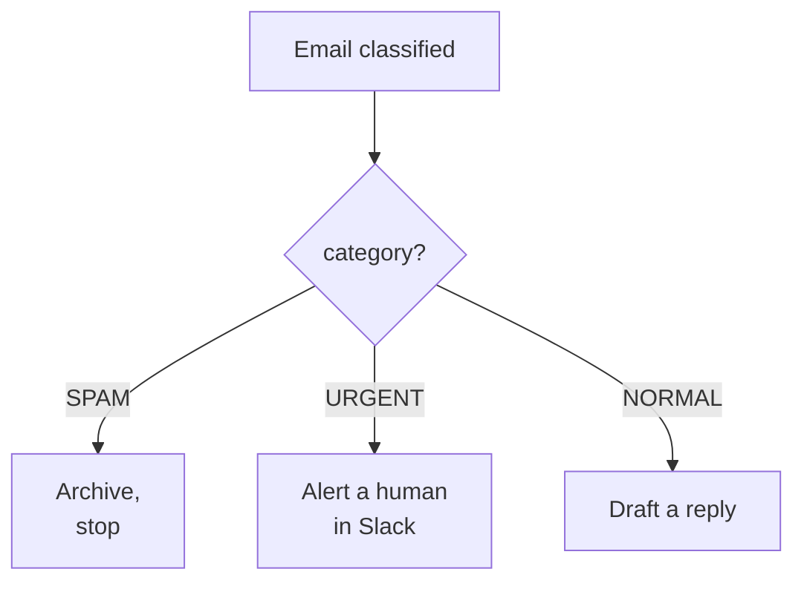

# A Real Example

Let's build something real, in words. The job: a shared support inbox gets forty to eighty emails a day. Most are routine. A few are urgent. Some are spam. Right now a person reads every one, decides what it is, and writes a reply from scratch. We are going to make an automation read each email, sort it, and write a draft reply for the routine ones — leaving the human to approve and send, not to start from a blank page.

You can do this in Zapier, Make, or n8n. The names of the blocks differ a little; the shape is identical. We'll describe it tool-neutrally.

## Step 1 — The trigger

Start with the event that wakes the flow up: a new email in the support inbox.

In your automation tool you add a Gmail (or Outlook) trigger set to "new email matching this label/folder." Connect it to the inbox account once, and from then on the tool checks for new mail every minute or so. Each time one arrives, it grabs the sender, subject, and body and hands them to the next step.

A small thing that saves pain later: filter the trigger to a specific label, not the whole inbox. You do not want your flow firing on internal mail, calendar invites, or your own sent replies. Set up a Gmail filter that labels real inbound support mail, and point the trigger at that label.

## Step 2 — Classify it

Now the AI step. This one reads the email and decides what kind it is. You give it an instruction and feed it the email body from Step 1.

```text
You are triaging support emails. Read the email and respond with a single
JSON object and nothing else:

{ "category": "URGENT" | "NORMAL" | "SPAM", "reason": "<short phrase>" }

URGENT = angry customer, outage, payment problem, or a threat to leave.
NORMAL = routine question we can answer.
SPAM = marketing, phishing, or irrelevant.

Email:
{{body from Step 1}}
```

Two choices worth understanding here. First, asking for JSON (a tidy `key: value` shape) instead of loose prose makes the answer straightforward for the next blocks to read — they can pull out `category` cleanly. Second, the `reason` field is for you, not the machine; it shows up in your logs and makes it obvious later why the AI sorted something the way it did.

The AI step sends this off, waits a second or two, and hands back the JSON. Most automation tools can parse it into separate fields automatically, so downstream blocks can refer to "category" and "reason" by name.

## Step 3 — Branch on the answer

Add a router (Make calls it a Router, Zapier calls it Paths, n8n calls it a Switch). It splits the flow three ways based on the `category` value:



- **SPAM** → archive the email and stop. No reply, no draft, no human time spent.
- **URGENT** → do not try to auto-draft anything clever. Post a message to a Slack channel: "Urgent support email from {{sender}} — {{subject}} — reason: {{reason}}," with a link to the email. A person handles it now.
- **NORMAL** → continue to the drafting step.

The discipline here is to let the AI's judgment route the work, but to keep the riskiest path (URGENT) in human hands. The automation's value on that path is speed of alerting, not the reply itself.

## Step 4 — Draft a reply (NORMAL only)

A second AI step, on the NORMAL branch only. This one writes a first-draft reply.

```text
Write a friendly, concise reply to this customer support email.
Use a warm but professional tone. Do not make up facts, order numbers,
prices, or policies — if you need information you don't have, leave a
clearly marked blank like [CHECK: refund amount].
Sign off as "The Support Team".

Customer email:
{{body from Step 1}}
```

The "do not make up facts, leave a marked blank" instruction matters more than anything else in this prompt. Left to its own devices, an AI will happily invent an order number or quote a return window that does not exist. By telling it to leave `[CHECK: ...]` placeholders instead, you turn a dangerous guess into an obvious to-do the human will catch.

## Step 5 — Save the draft, don't send it

The final action: save the AI's text as a Gmail draft on the original thread. Do not auto-send.

This is the single most important decision in the whole build. The flow has done the heavy lifting — read the mail, sorted it, written a reply with the blanks marked. A human opens the drafts folder, skims each one, fills any `[CHECK: ...]` blanks, and hits send. What took five minutes per email now takes thirty seconds.

You could, eventually, auto-send the most boilerplate replies (password resets, "we got your message"). Do that only after weeks of watching the drafts and trusting them — and even then, only for the narrowest, safest categories.

## What you end up with

| Email type | What the flow does | Human time |
|-----------|--------------------|-----------|
| Spam | Archived silently | None |
| Urgent | Instant Slack alert with context | Full attention, fast |
| Normal | Draft reply waiting, blanks marked | Skim and send |

The inbox sorts itself. Urgent things surface in seconds instead of whenever someone next checks mail. Routine replies arrive pre-written. And nothing actually leaves the building without a person looking at it. That last part is the bridge to Phase 3, where we make sure this thing stays trustworthy when it inevitably gets something wrong.
