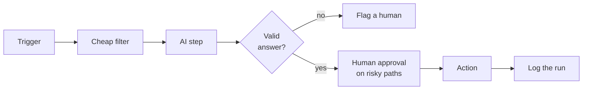

# Guardrails

An automation that calls AI is a robot you have hired and then stopped watching. It will run a thousand times whether or not it is doing the right thing. The flow from Phase 2 is useful precisely because it works unattended - which is also exactly why it can do damage unattended. This phase is the boring, essential part: the rails that keep it trustworthy. Skip them and you will eventually find out the hard way.

Four things to get right: cost, wrong answers, human approval, and logging.

## Cost: cap it before it surprises you

Each AI step costs a small amount of money per run - usually a fraction of a cent for short text, more for long documents. A fraction of a cent feels like nothing. Then your flow loops over a 10,000-row spreadsheet, or a misconfigured trigger fires on every email in your archive, and you have a bill.

Three habits keep this sane:

- **Put a cap on the account.** Both the AI provider (OpenAI, Anthropic) and the automation tool let you set a monthly spending limit or a usage budget. Set one. Treat it as a smoke alarm, not a target.
- **Filter before the AI step, not after.** Every item that reaches the AI step costs money. If half your triggers are irrelevant, filter them out with a free no-code condition *before* the paid AI block runs. Cheap rules first, expensive judgment second.
- **Watch the first big run.** The dangerous run is the first one against real volume. Run it once, manually, on a small batch. Check the cost it reported. Multiply up. Then turn it loose.

A runaway loop is the classic horror story - a flow that triggers itself, calls the AI, which triggers the flow again. Before you switch anything to "on," trace the path and make sure no action your flow takes can become its own trigger.

## Wrong answers: assume they will happen

AI steps are wrong sometimes, and they are wrong with total confidence. The model will not tell you it guessed. So you design as if every answer might be wrong and ask: what happens then?

A few concrete defenses:

- **Constrain the output.** An instruction that says "reply with exactly one of URGENT, NORMAL, SPAM" is far safer than an open-ended one, because you can check the answer is one of those three and route anything else to a human. Free-form answers are free-form failures.
- **Validate before you act.** Add a condition after the AI step: if the answer is not one of the values you expected, do not proceed - flag it. An empty answer, an error, or a surprise category should never silently fall through to "send."
- **Make hallucinations visible.** The `[CHECK: ...]` blanks from Phase 2 are a guardrail. So is refusing to let the AI fill in numbers, prices, or names it was not given. Design the prompt so that a gap shows up as a blank, not as a confident invention.
- **Fail loud, not silent.** If the AI step errors or returns junk, the flow should stop and tell someone, not quietly skip the item. A skipped urgent email is worse than a noisy alert.

## Human approval: a person on the risky path

The single most reliable guardrail is a human between the AI and any action that is hard to undo. Sending an email, posting publicly, charging a card, deleting a record - these get a person.

The pattern is "draft, don't do." Phase 2 used it: the flow writes the reply but saves it as a draft. A human approves and sends. You can build the same gate explicitly with an approval step - the flow pauses, sends someone a message with two buttons (Approve / Reject), and waits. Make, Zapier, and n8n all support some version of this pause-for-approval.

Calibrate the gate to the stakes:

| Action | Reversible? | Gate |
|--------|-------------|------|
| Archive spam | Yes (un-archive) | None needed |
| Save a draft reply | Yes | None - the send is the gate |
| Send an external email | No | Human approval |
| Refund / charge / delete | No | Human approval, always |

As trust builds over weeks, you can remove the gate from the safest, narrowest categories - but earn it with evidence, don't assume it.

## Logging: so you can answer "what did it do?"

When an unattended flow has been running for a month, someone will eventually ask why a particular customer got a strange reply, or why an email got marked spam. If you cannot answer that, you cannot trust the system.

Log every run. The cheapest way: add a step that appends a row to a Google Sheet or Airtable on each pass, recording the timestamp, the input (sender, subject), the AI's decision and its `reason`, and what action the flow took. It costs nothing and it is the difference between "we don't know" and "here's exactly what happened on May 3rd at 2:14pm."

A good log lets you do three things: debug a specific weird case, spot patterns (the AI keeps misreading a certain kind of email), and prove to yourself the thing is actually working before you widen its reach.

## Putting it together

These four rails are not optional extras you add if you have time. They are what turns a clever demo into something you can actually leave running.

Filter to control cost. Validate to catch wrong answers. Gate the irreversible actions behind a person. Log everything. Do those four, point the flow at high-volume, low-stakes work, and you have a robot worth trusting - one that does the boring 95% and hands you the 5% that needs a human, instead of a black box you cross your fingers over.
