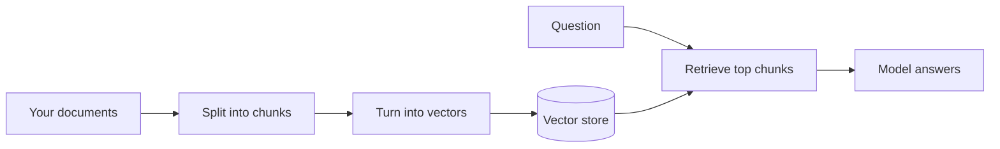

# How It Works

RAG is a pipeline with four steps. Two of them happen once, ahead of time, when you load your documents in. The other two happen every time someone asks a question. None of it requires math to understand — the whole thing is "make the documents searchable, then search them before answering."

Here's the shape:



Steps B and C are the one-time setup. Steps F and G run on every question. Let's walk each one.

## Step 1: Chunk the documents

You can't hand the model a 200-page manual every time someone asks a question — it's too much to read, and most of it is irrelevant to any single question. So the first job is to chop your documents into bite-sized pieces. A chunk might be a paragraph, a section, or a few hundred words. These chunks are what the system searches over and retrieves.

Chunking sounds boring. It is the single most important setup decision you'll make, and Phase 3 explains why. For now, hold this thought: a chunk should be big enough to contain a complete idea, but small enough that it's mostly *about* one thing. A chunk that's half about refunds and half about shipping will haunt you later.

## Step 2: Turn each chunk into a vector

This is the part that sounds like magic, so let's strip the magic off.

A computer can't search text by *meaning* the way you do. If your document says "reimbursement" and someone searches "getting my money back," a plain keyword search misses it — no shared words. RAG fixes this by converting each chunk into a list of numbers called an **embedding**, or a **vector**. The trick of these numbers is that chunks with similar *meaning* get similar numbers. "Reimbursement policy" and "how to get money back" land close together, even with no words in common.

The way to picture it: imagine every chunk gets dropped onto a giant map, and things that mean similar things land near each other. All the refund-related chunks cluster in one neighborhood, the shipping chunks in another, the password-reset chunks somewhere else entirely. The vector is only the chunk's address on that map. (The real "map" has hundreds of dimensions, not two — but you never have to think about that. "Similar meaning lands nearby" is the whole idea.)

A separate AI model, called an embedding model, does this conversion. You run all your chunks through it once and store the resulting vectors in a **vector store** (or vector database) — a system built to answer one question fast: "which stored vectors are closest to this one?"

## Step 3: Retrieve the relevant chunks

Now someone asks a question. The system runs the *question* through the same embedding model, turning it into a vector too — an address on the same map. Then it asks the vector store: which chunks live closest to this question?

The store hands back the top few — often the closest three to ten chunks. Those are your open-book pages: the passages most likely to contain the answer. This is the "retrieval" in retrieval-augmented generation, and it usually takes a fraction of a second even across millions of chunks.

Note what this step does *not* do: it doesn't understand the answer, it doesn't reason, it doesn't check anything. It's a similarity match. It returns the chunks that look most related to the question. Whether they actually answer it is a gamble that Phase 3 will make you respect.

## Step 4: Hand them to the model and answer

Finally, the system builds a prompt that stitches the retrieved chunks together with the original question. Roughly:

```text
Use the following passages to answer the question.
If the answer isn't in them, say you don't know.

[chunk 1: ...]
[chunk 2: ...]
[chunk 3: ...]

Question: What's our refund window for enterprise customers?
```

The model reads the passages and writes an answer grounded in them. Because the relevant text is right there in front of it, it doesn't have to recall anything from training — it reads off the page. A well-built system also returns *which* chunks it used, so the answer comes with citations you can click and verify.

That instruction — "if the answer isn't in the passages, say you don't know" — is doing heavy lifting. It's the system's attempt to stop the model from filling gaps with invention. It helps. It does not fully work, which is the heart of the next phase.

## The whole thing in one breath

Set-up, once: split your documents into chunks, convert each chunk to a vector, store the vectors. Per question: convert the question to a vector, find the nearest chunks, paste them in front of the model, let it answer from them.

That's RAG. Every "chat with your PDF," every support bot trained on a help center, every internal "ask the wiki" tool is some version of these four steps. The concept is clean. The reason real systems still give wrong answers isn't the concept — it's that each of these four steps has a way to quietly fail. That's where we go next.
