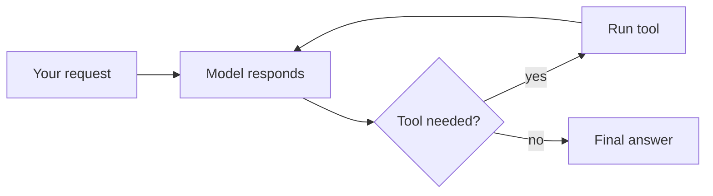

# The Model, the Tools, and the Loop

Strip away the branding and every AI assistant you've used is the same three parts stacked together. Learn the three and you can look at any new product — a chatbot, a coding assistant, a customer-support bot — and see its skeleton. Let's take them one at a time.

## Part one: the model predicts the next bit of text

At the center is a large language model, the LLM. People describe it as "AI that understands language," but the honest version is smaller and stranger: it predicts the next bit of text, over and over, very fast.

Think of the world's most over-read autocomplete. You've seen your phone suggest the next word when you text. The model does that, except it has read an enormous amount of writing and it predicts not one word but a whole flowing answer, one small piece at a time. You give it some text — your question — and it produces the text that most plausibly comes next based on everything it has seen.

That's the whole trick. There's no fact-checker inside, no little librarian confirming things are true. It produces text that *sounds right* given the pattern of your question. Most of the time, sounding right and being right line up, because true statements are what people tend to write. But not always — and that gap is the source of most of the trouble we'll cover in Phase 3.

One word you'll hear: **tokens**. A token is the unit the model reads and writes in — roughly a word or a chunk of one. You don't need to track this, but it explains why these tools sometimes charge "per token" and why very long documents cost more or get cut off. The model can only hold so much text in view at once; that working space is its **context window**. Think of it as the desk it's working on. Big desk, more papers in view. Once the desk is full, older papers slide off.

## Part two: tools let it act

A raw model can only do one thing: produce text. It can't check today's weather, search your files, send an email, or run a calculation. On its own it's a brilliant talker locked in a room with no phone.

**Tools** are the phone. A tool is some outside ability the model is allowed to call — search the web, look up an order in a database, run a snippet of code, fetch a webpage. The model doesn't run these itself. Instead it writes out, in a structured way, "I want to use the web-search tool with the query *flight delays JFK today*." The surrounding software actually runs the search, then hands the results back to the model as more text to read.

Picture a smart assistant who can't leave their desk but can write notes and slide them under the door. "Please look this up." A helper outside does it and slides the answer back. The assistant reads it and keeps going. The model never touches the outside world directly — it asks, something else acts, the result comes back as text.

This is why the same underlying model can feel dramatically different across products. Give it web search and it stays current. Give it access to your calendar and it can book things. Give it nothing and it's a clever conversation and not much more. The tools define what it can *do*; the model decides when to reach for them.

## Part three: the loop ties it together

The third part is the quiet one, and it's where "agents" come from. The model produces text. Sometimes that text is a finished answer for you. Sometimes it's a request to use a tool. Something needs to look at each response and decide: are we done, or does this need another round?

That something is the **loop**. The cycle looks like this:

```text
1. Read everything so far (your request + results from any tools used)
2. Model produces its next response
3. Is it a tool request?
   - Yes -> run the tool, add the result to the conversation, go back to step 1
   - No  -> it's the final answer, show it to the user and stop
```



A single round trip — you ask, it answers, done — is a chatbot. Many rounds, where the model uses a tool, reads the result, uses another tool, reads that, and keeps going until the job is finished — that's an **agent**. Same model, same tools. The difference is how many times the loop runs before stopping.

That's the whole machine. A model that predicts text. Tools that let it act. A loop that runs the cycle until the work is done. Everything labeled "AI assistant," "copilot," or "agent" is some arrangement of these three. When a new product confuses you, ask the three questions: *What model is underneath? What tools can it reach? How many times does the loop run?* The answers tell you most of what you need to know — including what it'll be bad at, which is next.
