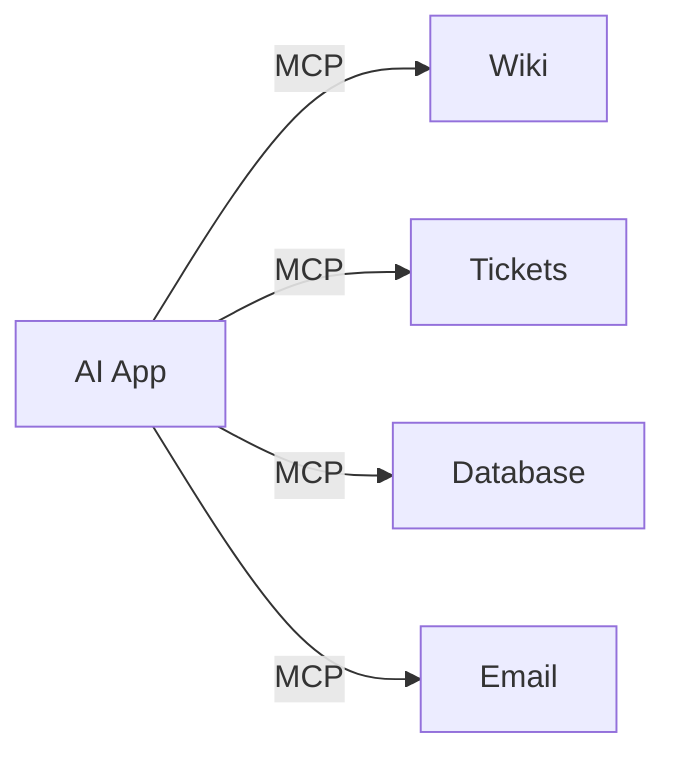

# The USB-C Port for AI

Think about what life was like before USB-C. Your camera had one cable, your phone had another, your printer had a third, and every laptop had a different mix of ports. Connecting two things meant finding the right adapter or giving up. Then a single connector arrived that most devices agreed to use, and the adapter drawer started to empty out. You stopped thinking about the cable and started thinking about what you wanted to do.

MCP is that connector, but for AI assistants and the tools they need to reach. The assistant is the laptop. Your calendar, your file storage, your customer database, your project tracker — those are the devices. MCP is the shared port that lets them plug into each other without anyone building a special adapter for each pair.

## The problem it actually solves

Here's the mess MCP cleans up. Say you have three AI apps and four services you'd like them to use — a wiki, a ticketing system, a database, and email. If every connection is bespoke, you're potentially on the hook for twelve separate integrations, each written by hand, each maintained on its own, each breaking in its own special way. Add one more AI app and you've signed up for four more.

This is sometimes called the M-times-N problem: M apps times N tools equals a lot of glue. Every pairing is its own little project, and none of the work carries over. The team that wired up your wiki to one assistant gets no help at all when a new assistant shows up.

MCP turns that multiplication into addition. Each tool gets connected once, the MCP way. Each app learns to speak MCP once. After that, any app works with any tool, because they're all agreeing on the same handshake. Twelve fragile bridges become four reusable ones plus three apps that already know how to cross them.

The diagram looks unremarkable, and that's the point. One kind of arrow, repeated. Before MCP, every arrow would have been a different shape.

## What "open standard" buys you

MCP was published by Anthropic in late 2024 and released openly, meaning the rules of the handshake are public and anyone can build to them. That matters for a practical reason: you're not betting on a single vendor's private connector. A growing list of AI apps support MCP, and a growing catalog of tools ship MCP connectors. When something is an open standard, the people who build connectors and the people who build assistants don't have to coordinate or even know about each other. They both target the same spec, and things fit.

Compare that to a closed plugin system tied to one product. If that product fades, so does every plugin built for it. An open protocol spreads the work across the whole ecosystem, which is exactly why USB-C won and proprietary chargers lost.

## What actually flows through the connection

It helps to be concrete about what's moving across this "cable." MCP doesn't pour your entire database into the assistant. It sets up a conversation. The assistant can ask, "what can you do?" and the tool answers with a menu — search the wiki, create a ticket, look up a customer. When the assistant wants something done, it picks an item off that menu and the tool runs it and hands back the result.

So the flow is request and response, mediated by a standard format both sides understand. You ask your assistant, "what did we decide about the refund policy?" The assistant realizes it needs the wiki, asks the wiki connector to search for "refund policy," gets back the relevant pages, and writes you an answer grounded in them. No copy-paste, no custom code, no you-in-the-middle ferrying text around.

## Why you should care even if you don't code

The payoff is that your assistant stops being a smart stranger and starts being a colleague who can see your stuff. Without a connection, you're forever pasting context in by hand — here's the spreadsheet, here's the thread, here's the doc. With MCP, the assistant reaches for those things itself, with your permission. The work it can actually finish for you expands from "answer questions about text I paste" to "go look at the real thing and act on it."

That expansion is genuinely useful and genuinely worth a second of caution, because a tool that can reach your data can also misuse it or be misused. That's the trade we'll get into in Phase 3. For now, hold onto the mental model: MCP is one shared port, openly published, that lets any AI app talk to any tool through the same handshake — so the glue gets written once instead of a hundred times.
