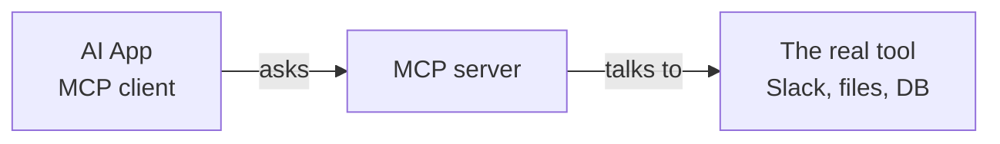

# Servers, Tools, and Resources

Now let's open the hood. When someone says "add an MCP server," what exactly are you adding, and what does it give the assistant access to? The vocabulary is small once you see it, and getting it straight makes every later decision clearer.

## Server and client: who's who

There are two roles in any MCP connection. The **client** lives inside your AI app - it's the part of the assistant that knows how to speak MCP and reach out. The **server** sits in front of a tool or data source and answers those reach-outs. A Slack MCP server, for example, stands between your assistant and Slack and translates requests into Slack actions.

The word "server" trips people up because it sounds like a machine humming in a data center. Here it mostly doesn't mean that. Many MCP servers are small programs that run right on your own computer, started up quietly when your AI app launches. Some do run remotely as a hosted service. Either way, "server" is a role - the thing that exposes capabilities - not necessarily a big remote box.



One assistant can have several servers connected at once: one for your files, one for your calendar, one for your database. Each is a separate plug into a separate capability.

## The three things a server can offer

An MCP server exposes up to three kinds of things. You don't need to memorize the internals, but knowing the categories tells you what you're switching on.

| Kind | What it is | Who decides to use it | Plain example |
|------|------------|----------------------|---------------|
| **Tools** | Actions the assistant can run | The assistant (with your guardrails) | "Create a calendar event," "send a message," "run a search" |
| **Resources** | Data the assistant can read | Usually you or the app | A file, a wiki page, a database record |
| **Prompts** | Pre-written instruction templates | Usually you, on purpose | "Summarize this ticket in our house format" |

**Tools** are the verbs. They're things the assistant can *do*: look something up, create a record, post a message, run a query. This is the category that gives MCP its reach - and the one that deserves the most care, because a tool can change things in the real world, not only read them. "Search the wiki" is gentle. "Delete the file" is not. Both can be tools.

**Resources** are the nouns. They're data the server can hand over for the assistant to read: the contents of a document, the rows of a table, the text of a page. Resources are read-oriented - they bring context in. When your assistant answers a question using your actual files, resources are how those files reached it.

**Prompts** are reusable instruction templates the server offers up. Think of them as saved recipes. A support-tool server might offer a "draft a customer reply" prompt that already knows your tone and required disclaimers, so you don't reinvent the wording every time. These are usually triggered on purpose, by you, rather than chosen by the assistant on its own.

The line between tools and resources is worth holding onto. Reading is lower-stakes than acting. A server that only exposes resources can show your assistant things; a server with tools can also make it *do* things. When you evaluate a server in Phase 3, "does this thing only read, or can it also act?" is one of the first questions to ask.

## How a request actually goes

Here's the sequence when you ask your assistant something that needs a connected tool. Say you've got a project-tracker server connected and you ask, "what's blocking the launch?"

```text
1. You ask the question.
2. The assistant sees a project-tracker server is connected.
3. It asks that server: "what can you do?" -> server lists its tools.
4. It picks a tool, e.g. "search issues," and calls it with "blocking + launch."
5. The server queries the real tracker and returns the matching issues.
6. The assistant reads those results and writes you a plain-language answer.
```

Two things are worth noticing. First, the assistant discovers what a server can do by asking - it isn't hardcoded, which is exactly what lets any app work with any server. Second, the assistant is the one deciding which tool to call and with what inputs. It's reasoning about your request and choosing actions. That autonomy is what makes a connected assistant feel capable, and it's also why the permissions in the next phase matter: you're letting something make calls on your behalf, and it won't always choose perfectly.

## Why the structure is worth knowing

You can use a connected assistant without any of this, the same way you can drive without knowing what a transmission is. But the moment something goes sideways - the assistant did something you didn't expect, or refused to do something you wanted - this vocabulary is how you reason about it. "It couldn't find that because the wiki is a resource the app didn't load." "It was able to send that message because the Slack server exposes a send tool." "I want the read access but not the delete tool."

Servers expose capabilities; tools act; resources inform; prompts standardize. Hold that, and the question of what to allow stops being a mystery and becomes a checklist. Which is exactly where we go next.
